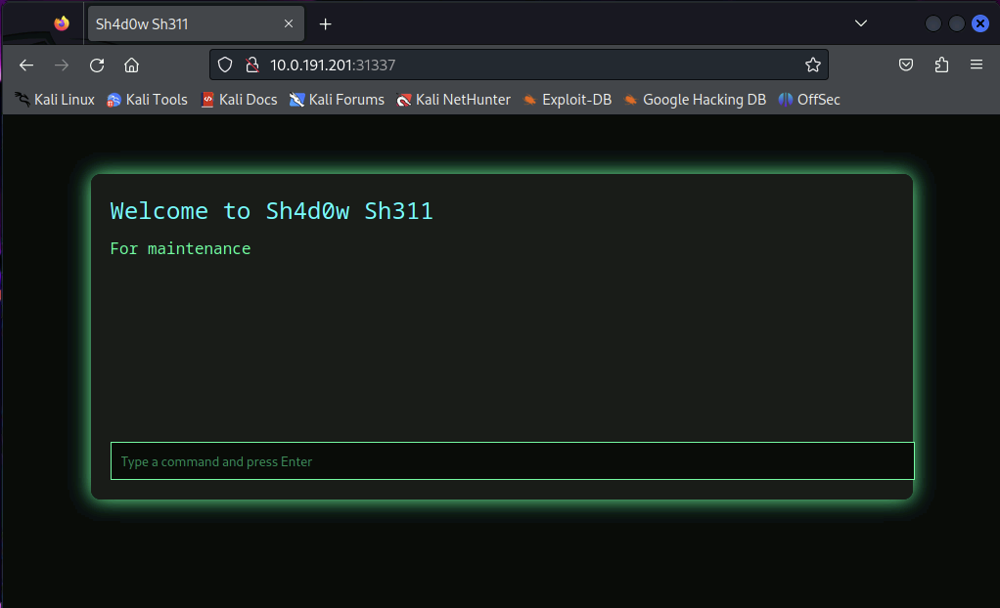
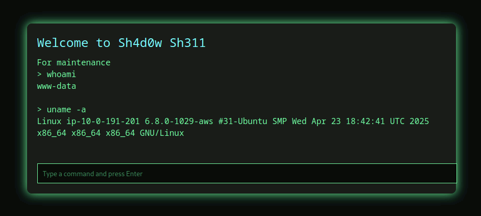
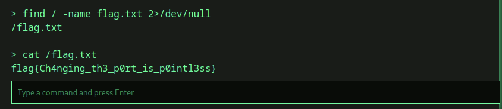

# writeup

本問題は、ペネトレーションテストの基本となるポートスキャンを実行し、非標準ポートで動作している管理用のWebシェルを発見し、サーバ内を探索する問題です。

## ポートスキャン

IPアドレス以外の情報がないため、nmapを用いてポートスキャンを実行し、空いているポートや動作しているサービスを列挙します。

```
$ nmap 10.0.191.194
Starting Nmap 7.95 ( https://nmap.org ) at 2025-08-26 21:43 JST
Nmap scan report for ip-10-0-191-194.ap-northeast-1.compute.internal (10.0.191.194)
Host is up (0.0018s latency).
Not shown: 998 closed tcp ports (reset)
PORT      STATE SERVICE
22/tcp    open  ssh
31337/tcp open  Elite

Nmap done: 1 IP address (1 host up) scanned in 0.31 seconds
```

`22/tcp`では`ssh`、`31337/tcp` では `Elite` というサービスが動作しているようです。
`ssh` は一般的に認証があり、攻撃できる可能性が低いので一旦置いておきます。

## バージョンの調査

`Elite`はあまり聞き馴染みのないサービスです。 こちらのサービスについて `nmap -sV` を用いてバージョンを詳細に調べてみましょう。

```
$  nmap -p31337 -sV 10.0.191.194
Starting Nmap 7.95 ( https://nmap.org ) at 2025-08-26 21:51 JST
Nmap scan report for ip-10-0-191-194.ap-northeast-1.compute.internal (10.0.191.194)
Host is up (0.0017s latency).

PORT      STATE SERVICE VERSION
31337/tcp open  http    Apache httpd 2.4.58 ((Ubuntu))

Service detection performed. Please report any incorrect results at https://nmap.org/submit/ .
Nmap done: 1 IP address (1 host up) scanned in 6.38 seconds
```

この結果から、`31337/tcp`では実際にはHTTPサービス（Webサーバ）が動いており、Ubuntu OSで動作していることが推測できます。

## Webサーバへのアクセス
WebブラウザでターゲットのIPアドレス、ポート番号にアクセスしてみます。



アクセスすると、Webページが表示されました。
テキストボックスに「Type a command and press Enter」と書かれていることから、コマンドを入力するとコマンドが実行できそうです。

バージョン調査の結果から、このサーバは `Ubuntu` で動いていることがわかっています。
そこで試しにLinuxコマンドを入力してみましょう。
今回は以下のコマンドを実行します。

* 実行したコマンドがどのような権限で動いているかを確認するために、プログラムを動かしているユーザ名を確認する `whoami`
* どのようなOSで動作しているかを確認するために、OSのバージョン情報を調べる `uname -a`



コマンドを入力しEnterを押すとコマンドの実行結果が表示されたので、Linux のコマンドが正常に実行できることがわかりました。

## Flagの探索と獲得

サーバ内の flag.txt の場所がわからないので、`find` コマンドを用いて flag.txt を探します。

```sh
find / -name flag.txt 2>/dev/null
```

`/` （Linuxのルートディレクトリ）に flag.txt があることがわかりました。

あとは、flag.txt を `cat` で表示すると、フラグを取得できます。



```
flag{Ch4nging_th3_p0rt_is_p0intl3ss}
```