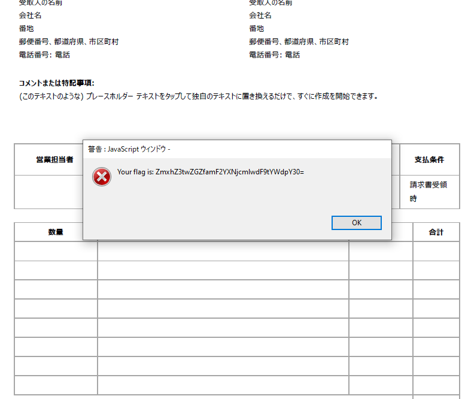
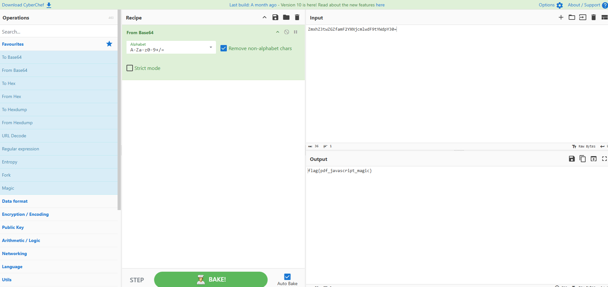
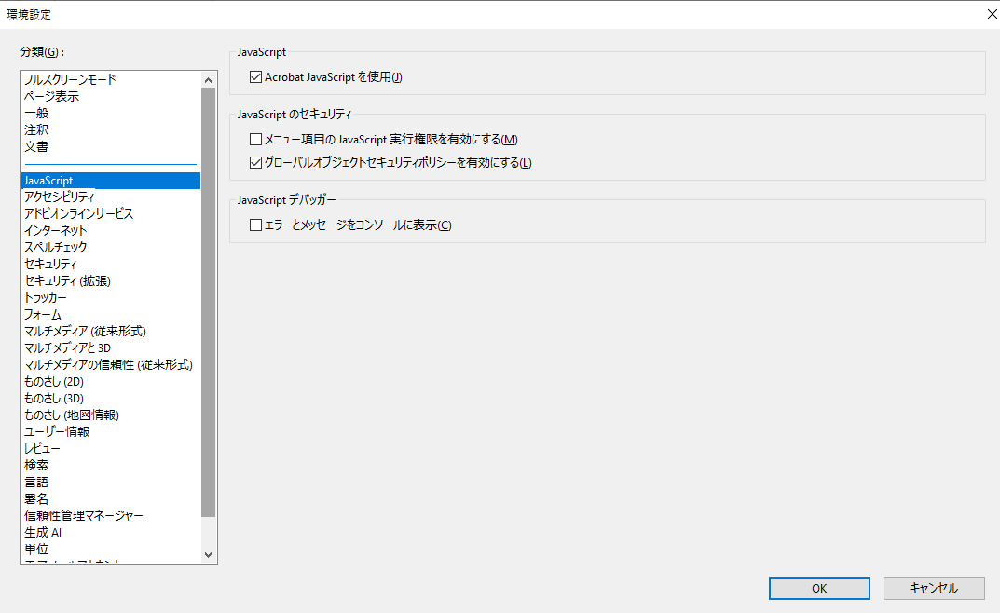

## Acrobatics WriteUp

### 1.配布されたPDFを解析する
下記のコマンドのように[pdf-parser](https://blog.didierstevens.com/programs/pdf-tools/)を用いて、PDFファイルのデータを抽出することで、このPDFはある挙動をすることがわかります。
抽出したPDFオブジェクトの1つ（obj 39 0）は、PDF内に定義された「リンクアノテーション（/Annot /Subtype /Link）」を表しており、ユーザがページ上の特定の範囲をクリックすることで何らかのアクションが実行される仕組みを示しています。
ここでは、アノテーションの領域 /Rect [ 0 0 595 842 ] により、A4のPDFページ全体がクリック可能な状態になっており、クリック時には別のオブジェクト（obj 38 0）に定義されたアクションが実行されるようになっています。

```
$ pdf-parser invoice.pdf
~省略~
obj 39 0
 Type: /Annot
 Referencing: 38 0 R

  <<
    /Type /Annot
    /Subtype /Link
    /Rect [ 0 0 595 842 ]
    /Border [ 0 0 0 ]
    /A 38 0 R
  >>
~省略~
```
ここまでで、PDF内のどこかをクリックすると何らかのアクションが起こると想定し、実際にPDFをクリックするとフラグにつながる情報が表示されます。

次に下記のコマンドのように`pdf-parser`を用いてPDFファイルのデータを抽出することで、クリック時に実行されるJavaScriptコードを抜き出すことができます。

```
$ pdf-parser invoice.pdf -o 38
This program has not been tested with this version of Python (3.13.3)
Should you encounter problems, please use Python version 3.11.1
obj 38 0
 Type: /Action
 Referencing: 

  <<
    /Type /Action
    /S /JavaScript
    /JS '(var\\040\\137d\\040\\075\\040\\13389\\054111\\054117\\054114\\05432\\054102\\054108\\05497\\054103\\05432\\054105\\054115\\05458\\05432\\054\\040\\04090\\054109\\054120\\054104\\05490\\05451\\054116\\054119\\05490\\05471\\05490\\054102\\05497\\054109\\054\\040\\04070\\05450\\05489\\05488\\05478\\054106\\05499\\054109\\054108\\054119\\054100\\05470\\05457\\054116\\054\\040\\04089\\05487\\054100\\054112\\05489\\05451\\05448\\05461\\135\\073app\\056alert\\050String\\056fromCharCode\\056apply\\050null\\054\\040\\137d\\051\\051\\073)'
  >>
3
```
上記の出力の`/JS`箇所が実行されるJavaScriptを表しています。

これはAdobeの[PDF Reference](https://opensource.adobe.com/dc-acrobat-sdk-docs/pdfstandards/pdfreference1.7old.pdf)の TABLE 3.2 Escape sequences in literal strings において、文字列リテラル内のエスケープシーケンスとして8進数表記（\ddd）を使用できると明記されていることから、実際は下記の文字列であることがわかります。
※見やすさのために改行やインデントを適宜追加しています。

```
var _d = [
         89,111,117,114,32,102,108,97,103,32,
         105,115,58,32,90,109,120,104,90,51,
         116,119,90,71,90,102,97,109,70,50,89,
         88,78,106,99,109,108,119,100,70,57,
         116,89,87,100,112,89,51,48,61];
app.alert(String.fromCharCode.apply(null, _d));
```

`var _d`はASCIIコードの配列になっており、これを文字に変換して結合すると、\
- `Your flag is: ZmxhZ3twZGZfamF2YXNjcmlwdF9tYWdpY30=`

という文字列がPDFをクリックするとアラートとして表示されることがわかります。


### 2.配布されたPDFをプログラムから開く
ここまでで、PDFのページをクリックするとアラートが表示されるらしいことが得られました。ここでは実際に検証します。
配布されたPDFをAdobe Acrobat Readerで開き、JavaScriptの実行をできるように設定します。
その後、PDFのページをクリックすることで、次のようにアラートが表示されます。


ポップアップで表示される内容がフラグを表していそうです。ここで問題文にフラグがエンコードされているとの記載があるため、エンコード方法を調査します。アルファベットや数字があること、末尾にイコール記号があることをもとにインターネットで調査すると、Base64エンコードという方式があると分かります。

### 3.フラグをBase64でデコードする
ポップアップで表示されたフラグはBase64でエンコードされたものであるため、デコードを行います。
今回は[CyberChef](https://gchq.github.io/CyberChef/)を利用します。
CyberChefにて先ほどのBase64でエンコードされた文字列を入力として与え、レシピはBase64のデコード処理を選択すると、フラグが出力されます。


### 参考
#### JavaScriptを実行しないためのAdobe Acrobat Readerの設定
「メニュー」->「環境設定」->「JavaScript」->「Acrobat JavaScriptを使用」からチェックを外すと、JavaScriptを実行しないように設定できます。


#### PDFの悪用事例

このような手法は、2023年～2024年の最近でも確認されており、例えば、SANSのブログ記事 [Malicious PDF File Used As Delivery Mechanism](https://isc.sans.edu/diary/30848) では、PDF内のリンクアノテーションとJavaScriptアクションを組み合わせて、ユーザーが特定の領域をクリックした際にJavaScriptコードが実行される手法が紹介されています。

また、Trustwaveのブログ記事 [Threat-Loaded: Malicious PDFs Never Go Out of Style](https://www.trustwave.com/en-us/resources/blogs/spiderlabs-blog/threat-loaded-malicious-pdfs-never-go-out-of-style/) では、攻撃者がPDFファイル内にJavaScriptを埋め込み、exportDataObject関数を使用して埋め込まれたファイルを抽出・実行する手法が紹介されています。
この問題を通じて、実際の攻撃手法に対する理解を深め、セキュリティ対策の重要性を再認識していただければと思います。

