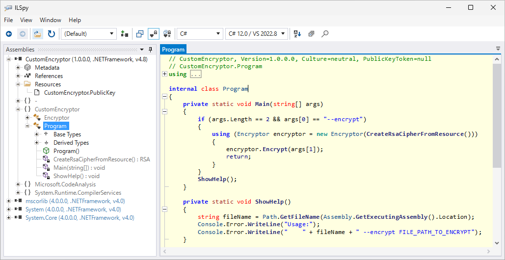
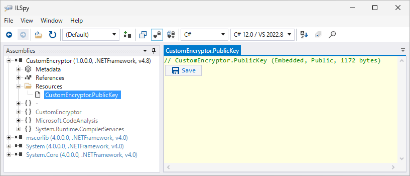
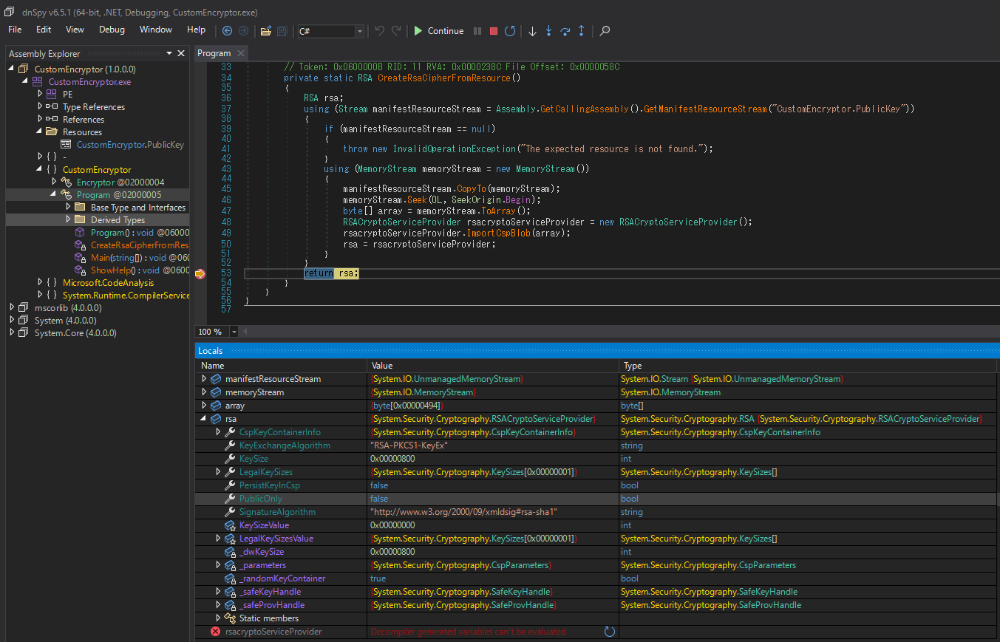
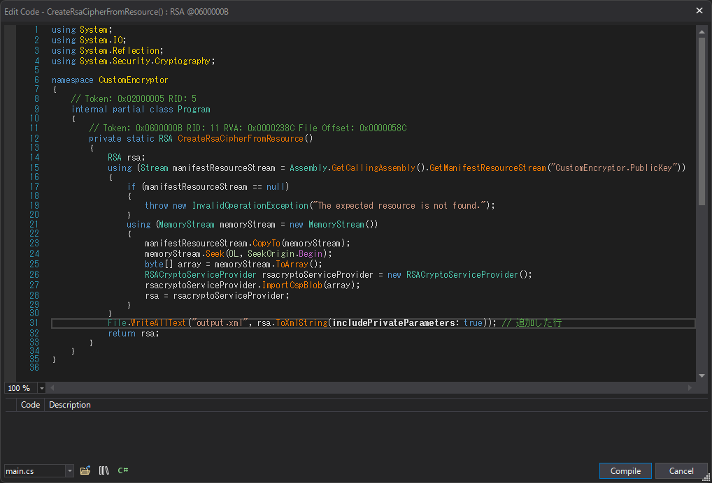

# CustomEncryptor

## 概要
`CustomEncryptor.exe` は、次の処理を行います。

1. リソースから`PublicKey`を取得し、RSA鍵を取得。
1. AES用の鍵(32バイト)、IV(16バイト)を作成し、ファイルをAES256-CBCで暗号化。
1. 暗号化に使用したAES用の鍵とIVを含む内容を、RSA-OAEP(ハッシュ関数にはSHA1を使用)で暗号化。
1. 上記2つの暗号化結果を結合して、暗号化後ファイルとする。

ランサムウェアがRSA暗号化を使用する場合、通常ではRSA公開鍵を使用します。RSA公開鍵では暗号化のみができ、復号はできません。

しかし`CustomEncryptor.exe`では実装誤りという想定で、`PublicKey`という名称のリソースが実際はRSA秘密鍵という不備が存在します。RSA秘密鍵はRSA公開鍵内容をすべて含むため、暗号化が問題なく成功します。そのため開発者は実装誤りに気付かなかった、という想定の問題です。

結果として、RSA秘密鍵を使ってAES用の鍵とIVを復号し、その内容からファイル本来の内容を復号できます。

## 解析ステップ
### 1. ファイル種類や使用ランタイムバージョンの解析
`file CustomEncryptor.exe` 等でファイル種類を調査すると、.NETアセンブリであることが分かります。.NET アセンブリでは一般的にMSILという中間言語で記述されており、逆コンパイルすると元ソースコードに近い内容を復元できます。

.NETアセンブリ用の逆コンパイルツールとして[ILSpy](https://github.com/icsharpcode/ILSpy)や[dnSpyEx](https://github.com/dnSpyEx/dnSpy)があります。

例としてILSpyを使って、`CustomEncryptor.exe`を読み込ませて逆コンパイルする場合の表示例を次に示します。



逆コンパイル結果を見ると`[assembly: TargetFramework(".NETFramework,Version=v4.8", FrameworkDisplayName = ".NET Framework 4.8")]`という属性指定があることから、`CustomEncryptor.exe`は.NET Framework 4.8で動作することも分かります。

なおILSpyでは、メニューの`File/Save code...`から`.csproj`を含む逆コンパイル結果一式を保存できるため、各種エディタやIDEを使って解析することもできます。

### 2. 静的解析
`CustomEncryptor.exe`では難読化等が施されていないため、元ソースコードと極めて近い逆コンパイル結果を得られます。特に、クラス名やメソッド名、フィールド名はメタ情報に含まれているため元通りの名称を得られます。一方でメタ情報に含まれないローカル変数名は失われます。

解析すると、次の処理を行うことが分かります。

1. `Program.Main`関数で、コマンドライン引数が `--encrypt FILE_PATH_TO_ENCRYPT` 形式であることを確認。
1. `Program.CreateRsaCipherFromResource`関数で、リソースの`CustomEncryptor.PublicKey`内容を読み込み、その内容で`RSACryptoServiceProvider.ImportCspBlob`を呼び出して鍵を設定。
1. `Encryptor.Encrypt`関数で、コマンドライン引数で与えられたファイルを暗号化。
    1. `FileStream`等を使って、ファイル内容を読み込み。
    1. `Encryptor.EncryptUsingAes` 関数で、暗号化結果のバイト列等を取得。
        1. 32バイトのランダムな鍵を生成。すなわちAES256となります。
        1. 16バイトのランダムなIVを生成。
        1. 暗号利用モードにCBCを、パディングにPKCS#7を使うよう設定。
        1. `CryptoStream`等を使って、読み込んだファイル内容をAES256-CBCで暗号化。
    1. `Encryptor.GenerateEncryptedFooter`で、暗号化ファイルの末尾に書き込ためのフッターデータを作成。
        1. 「AESの32バイトの鍵、AESの16バイトのIV、`TheFooterContent`文字列16バイト」の合計64バイトのデータを作成。
        1. `RSA.Encrypt`へ`RSAEncryptionPadding.OaepSHA1`を指定することで、RSA-OAEPで上記64バイトデータを暗号化し、256バイトのデータを作成。
    1. 「AES256-CBCでのファイル暗号化結果」と「RSA-OAEPでのフッター暗号化結果」を結合して、拡張子`.encrypted`ファイルへ保存。

元データを復元するためには、RSA秘密鍵が必要になります。

### 3. `PublicKey`リソース調査

#### 調査方法1: リソース内容解析
前述の通り、`CustomEncryptor.exe`はリソースの`CustomEncryptor.PublicKey`内容を読み込み、その内容で`RSACryptoServiceProvider.ImportCspBlob`を呼び出して鍵を設定します。リソース内容を確認します。

ILSpyの場合は、`CustomEncryptor.exe`を読み込ませ、左ツリーの`Resources`箇所から個別にリソースファイル内容を保存できます。



ファイルを保存してHexDumpすると、次の内容であることが分かります。
```
$ hexdump -C CustomEncryptor.PublicKey
00000000  07 02 00 00 00 a4 00 00  52 53 41 32 00 08 00 00  |........RSA2....|
00000010  01 00 01 00 71 20 ef d5  f1 bd 42 ed 39 10 6b e5  |....q ....B.9.k.|
00000020  42 49 0e 04 d0 98 91 eb  54 d3 22 39 1d a1 f0 59  |BI......T."9...Y|
00000030  2d fa 40 c6 80 cb 3d 11  f8 72 7f 72 8a 42 4a 86  |-.@...=..r.r.BJ.|
...(snip)...
```
`RSA2`という文字列が存在します。Microsoft社のドキュメントを探すために`"learn.microsoft.com" "RSA2"`等でインターネット検索すると、[RSAPUBKEY構造体](https://learn.microsoft.com/en-us/windows/win32/api/wincrypt/ns-wincrypt-rsapubkey)のドキュメントが見つかります。その中に`Set to RSA1 (0x31415352) for public keys and to RSA2 (0x32415352) for private keys.`の記述が見つかります。すなわち、`PublicKey`という名前のリソース内容が、RSA公開鍵ではなく実際はRSA秘密鍵である可能性が浮上します。

`"microsoft.com" "RSAPUBKEY"`等でインターネット検索すると、[Base Provider Key BLOBs](https://learn.microsoft.com/en-us/windows/win32/seccrypto/base-provider-key-blobs)のドキュメントが見つかります。その中の`Private Key BLOBs`箇所で、次のデータ構造との記述があります。
```
PUBLICKEYSTRUC  publickeystruc;
RSAPUBKEY rsapubkey;
BYTE modulus[rsapubkey.bitlen/8];
BYTE prime1[rsapubkey.bitlen/16];
BYTE prime2[rsapubkey.bitlen/16];
BYTE exponent1[rsapubkey.bitlen/16];
BYTE exponent2[rsapubkey.bitlen/16];
BYTE coefficient[rsapubkey.bitlen/16];
BYTE privateExponent[rsapubkey.bitlen/8];
```
[PUBLICKEYSTRUC構造体、別名BLOBHEADER構造体](https://learn.microsoft.com/en-us/windows/win32/api/wincrypt/ns-wincrypt-publickeystruc)のドキュメントとも照らし合わせながら、`CustomEncryptor.PublicKey`ファイル内容を確認します。

|オフセット|メンバー|データ内容|詳細|
|-|-|-|-|
|0x00|`PUBLICKEYSTRUC::bType`|0x07|`PRIVATEKEYBLOB`|
|0x01|`PUBLICKEYSTRUC::bVersion`|0x02|`CUR_BLOB_VERSION`|
|0x02|`PUBLICKEYSTRUC::reserved`|0x0000|0固定|
|0x04|`PUBLICKEYSTRUC::aiKeyAlg`|0x0000a400|`CALG_RSA_KEYX`|
|0x08|`RSAPUBKEY::magic`|0x32515352|ASCIIで`RSA2`|
|0x0C|`RSAPUBKEY::bitlen`|0x00000800|法`n`のビット数、10進数表記で`2048`、`modulus`以降のメンバーのサイズにも影響|
|0x10|`RSAPUBKEY::pubexp`|0x00010001|暗号化指数`e`、10進数表記で`65535`|
|0x14|`modulus`|略|法`n`|
|0x114|`prime1`|略|素数`p`|
|0x194|`prime2`|略|素数`q`|
|0x214|`exponent1`|略|`d mod (p-1)`|
|0x294|`exponent2`|略|`d mod (q-1)`|
|0x314|`coefficient`|略|`q^1 mod p`|
|0x394|`privateExponent`|略|復号指数`d`|
|0x494|(ファイル終端)||ファイルサイズ、10進数表記で`1172`|

各種メンバーや、ファイルサイズが一致することから、`PublicKey`リソースはRSA秘密鍵であることが判明します。RSA秘密鍵であるため暗号化フッターを復号でき、フッター中の情報から暗号化ファイル内容を復号できます。

#### 調査方法2: 動的解析
前述のdnSpyExを使うと、.NETアセンブリをデバッグ実行できます。Windows実行環境を用意して、適当な`--encrypt C:\not_exist.txt`等のコマンドライン引数で実行開始し、ステップ実行等で各種インスタンスの内容を確認すると、`Program.CreateRsaCipherFromResource`メソッドが返す`RSACryptoServiceProvider`型インスタンスの`PublicOnly`プロパティが`false`であることが分かります。



[RSACryptoServiceProvider.PublicOnlyプロパティ](https://learn.microsoft.com/en-us/dotnet/api/system.security.cryptography.rsacryptoserviceprovider.publiconly?view=netframework-4.8)のドキュメントを読むと、当該プロパティが`false`の場合は秘密鍵を持つことが分かります。

dnSpyExには.NETアセンブリを編集できる機能があります。今回の場合は、秘密鍵の内容を出力するように活用できます。今回の`CustomEncryptor.exe`が使用する.NET Framework 4.8の範囲で、`RSACryptoServiceProvider`型のドキュメントから活用可能なメソッドを探すと、基底クラスの`RSA`型側で[ToXmlStringメソッド](https://learn.microsoft.com/en-us/dotnet/api/system.security.cryptography.rsa.toxmlstring?view=netframework-4.8)が見つかります。

`CreateRsaCipherFromResource`メソッド箇所を右クリックして`Edit Method (C#)...`をクリックすると、コード編集用ダイアログが表示されます。`return`前に`File.WriteAllText("output.xml", rsa.ToXmlString(includePrivateParameters: true));`等を追加します。



ダイアログ右下の`Compile`ボタンをクリックしてダイアログを閉じ、メニューの`File/Save All...`をクリックして`CustomEncryptor.exe`を保存します。保存結果を改めて実行すると、ワーキングディレクトリに次の内容の`output.xml`が作成されます。
```xml
<RSAKeyValue><Modulus>vs/wzq0Tfu76gQ1VsY94HCM68jkXXRFUtiP7uGegGD/hYZqUZGOAVlUMT7KNni0jGo3bTYRhrbSnYEnK4tD445+I20Umtv9VEhe3eahfmj/ro3kbbpauIMhk7BwK0rc08Tvenhx9gd55nvfrRWsXyF/fCaigUKfspnLBHW3/EXwIEwPTajecDsmS35khkaAI5ynFpTwzwbfId5OfmtLDqQoFnrTwz5ugcjitfpB0hGUWgYCSy3me849ze0/1L8Izde3NtAkeEt25EzbjfV42HDTbHvGGSkKKcn9y+BE9y4DGQPotWfChHTki01TrkZjQBA5JQuVrEDntQr3x1e8gcQ==</Modulus><Exponent>AQAB</Exponent><P>6QZjQ1iYteFFnTEnWf4thQS8Dj+/FlLbncTCsN+ya2JvEe7OYDLW7zYYwqPT0bvt+sHqxQdK+4SYtxkBvEE6gpIDZJc56UELh7CaH9OT8v5QhiC5fmoF5ePtDS5V7yxWQM4bQMnZvHBK66OXtAFelpITOye0KO1JhQliP9GtYE8=</P><Q>0aAX7ElwIeYzE55l3qojoGDdH0wuhCIyqcZK+ztBN+Iw9QqaYM+HYJY0v5jqUSCwNN+GU2U464XDNVrq8MbC8sFTNM0ZeHqSnclc7CPDP1DODw6u6Rgc5S/NKgYQ0MwFzOOZzNrH1t005wjGsCDpz63p5llcVMPJaIMFumFEgz8=</Q><DP>cEBFfOGm3qaf9DMDc9R/dP5s4KhQkp5jcMKhzrZTqmsGeisBe1HCPAVhNBHbLcNLxmm3gCYdNsAPGNSRA3CgkNlpjQFUQkq1FS47cG1pbbqYa6RD9uN35+A+BwV1G/vNqPYgJruVibLGRHDP2UR3nizL2skrfjOgINf+XiPRUv0=</DP><DQ>i6TEiwmZA1wgpm8cmapptUsRwumzCx7k9Sg9hwNAPQQXbQW1NczJ+FPXq9MoNQc7mt1U1HVX573h/sckP2WJNMIIteHzl8i/pxEfL8fbJ3Ci9HDpoCoKBbtERzxnM1DWhFkSed88xSvzM/0qruYeG9VVPbhFw8nxgAfYZwKo620=</DQ><InverseQ>dRQYToRQnAzCoq5aC5TKxIXwjm1dpiIhq0kEE0No6nxpjy0TstCXu4L9rQXPvh6T9WlTjz9nX5ltnMaULg+4u5kTQmuVc6AF2YDKAqeU0HZftwlVb27CpoBDYJwrPlzl4qTqX8pVLWviIhZK+c9D8Ejj3s5J3c2Cc781DetMKZs=</InverseQ><D>Sn8/AkIakX1WOlptcZSVDU9H7VgS4hgpHa+w0I9MtwsBwKyscQFUEuDDnL4WgoIW6YAm9f3QcRROIM7Osn1qHtyjfxBhjCLmINk3nfz5zmxUYI+hAS09MLlsha5xH1G+Ds0UHmD7M2Ab1c/vgDvOnkGn/8phRPw67cVx1j6izj0Uy2IRp89yfHF8wU0VEznkoypD5+WC/qZTGoU1y1/e8rVbYUf8hcIBobXOPrWRgdKrQyFn4nlG43plpqHBgx1SKokkOFa5AMtmofeF+uL0PfcLOPktFm8mtSaGLd97npsAn5caSRxjRQ2R2JR5ziD0GkOkZQ3v2y2LurGXrH/4bQ==</D></RSAKeyValue>
```
Microsoft社のドキュメントでは`ToXmlString`メソッド結果のXML内容のデータ形式は明文化されていませんが、[Microsoft社のreferencesourceリポジトリ](https://github.com/microsoft/referencesource/blob/51cf7850defa8a17d815b4700b67116e3fa283c2/mscorlib/system/security/cryptography/rsa.cs#L318-L319)を見ると`RFC 3075`のSection 6.4.2形式である旨の記述があります。[RFC 3075 Section 6.4.2](https://datatracker.ietf.org/doc/html/rfc3075#section-6.4.2)を見るとbig endianやBase64エンコードが使用されている旨の記述があります。これらの情報をもとに逆操作を行うことで、RSA秘密鍵の各種数値が判明します。ここではPythonのREPLを使用します。
```python
>>> import base64
>>> def parse(data): return int.from_bytes(base64.b64decode(data), "big")
...
>>> # Modulus, n
>>> parse("vs/wzq0Tfu76gQ1VsY94HCM68jkXXRFUtiP7uGegGD/hYZqUZGOAVlUMT7KNni0jGo3bTYRhrbSnYEnK4tD445+I20Umtv9VEhe3eahfmj/ro3kbbpauIMhk7BwK0rc08Tvenhx9gd55nvfrRWsXyF/fCaigUKfspnLBHW3/EXwIEwPTajecDsmS35khkaAI5ynFpTwzwbfId5OfmtLDqQoFnrTwz5ugcjitfpB0hGUWgYCSy3me849ze0/1L8Izde3NtAkeEt25EzbjfV42HDTbHvGGSkKKcn9y+BE9y4DGQPotWfChHTki01TrkZjQBA5JQuVrEDntQr3x1e8gcQ==")
24087817301548667964381398099593599221053612911973308458717128452386965238770910309994101083064317450907525029532615056522888535655860543576131466970519533175472020827481499401766865879604472872135756968332012548974307228639808781009978454836733275972648755106491385501876647448763103809880555873764851146477139771084863155349593597367417466002861653709995127197897954371829896951827257025891170595247194375876905220395973287516361021998112038143310568493600606448253233787322615516229246291571457389721908134293007113155041597196260394447102318605402414142863968098753166299628927577492790745340335086722758336258161
>>> # Exponent, e
>>> parse("AQAB")
65537
>>> # D
>>> parse("Sn8/AkIakX1WOlptcZSVDU9H7VgS4hgpHa+w0I9MtwsBwKyscQFUEuDDnL4WgoIW6YAm9f3QcRROIM7Osn1qHtyjfxBhjCLmINk3nfz5zmxUYI+hAS09MLlsha5xH1G+Ds0UHmD7M2Ab1c/vgDvOnkGn/8phRPw67cVx1j6izj0Uy2IRp89yfHF8wU0VEznkoypD5+WC/qZTGoU1y1/e8rVbYUf8hcIBobXOPrWRgdKrQyFn4nlG43plpqHBgx1SKokkOFa5AMtmofeF+uL0PfcLOPktFm8mtSaGLd97npsAn5caSRxjRQ2R2JR5ziD0GkOkZQ3v2y2LurGXrH/4bQ==")
9404381971935330686553043825233096163527454622254009849904560259261566436736977312080489866981501909095180477144987128663978347526229515059927611049860129321769421806197554437844405408569810143572907114282179609847957627892744362416685516943215196489191810685716390448701005207310397747584017930970615778642638843238175151908657160900844868809524475372772208690894084116446881240072473824937972546162267853868733787180326648297556403777496866517104638157717459516703589277906898005520851633073817019803539165243646030093027629837548177716712277197626148501011965113928724898905028411631570692934565651314986329307245
>>>
```


## 復号スクリプトの実装
次の手順で復号スクリプトを実装します。

1. `PublicKey`リソースからRSA秘密鍵内容を取得。
1. `secret.iso.encrypted`ファイル内容のフッター256バイトをRSA-OAEPで復号し、AESの鍵およびIVを取得。
1. `secret.iso.encrypted`ファイル内容のフッター256バイトを除外した本体部分をAES256-CBCで復号。

復号スクリプトの例として、[PyCryptodome](https://pycryptodome.readthedocs.io/en/latest/index.html)を使用するものを[solver.py](solver.py)に示します。

復号に成功するとISO形式のファイルを得られます。当該ISOファイルをマウントや展開して内容を確認すると`flag.txt`があり、その内容がフラグです。
