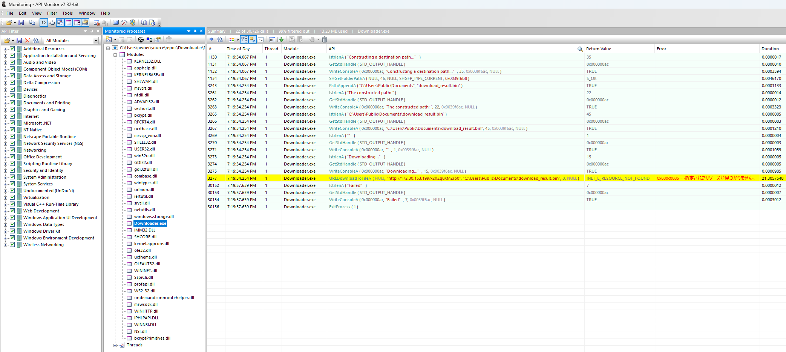
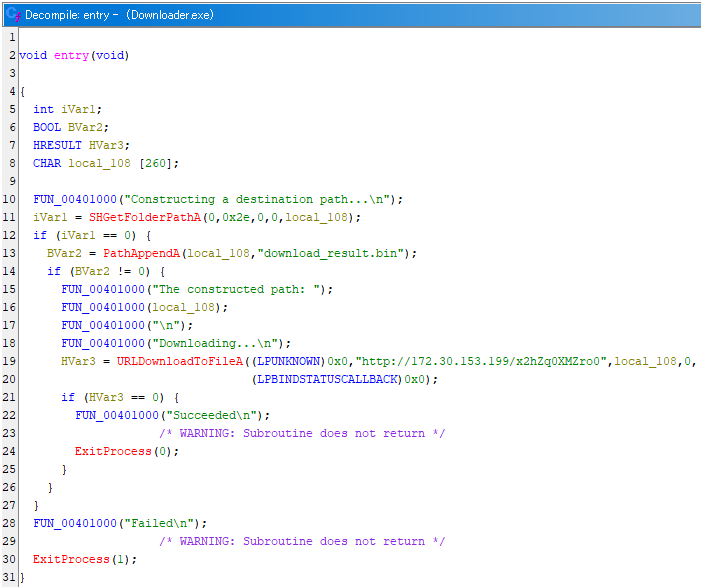

# writeup
今回の問題では、表層解析、動的解析、静的解析の3種類の解析方法すべてで通信先URLを解明できます。

## 方法1: 表層解析
表層解析とは、バイナリを実行することなく機械的に情報を収集する手法です。
問題文のヒントにある通り、バイナリ解析の最初に表層解析を行うことが多いです。

Linuxコマンドの`strings`コマンドで本問題のバイナリを解析すると、次のような出力が得られます。
```
$ strings Downloader.exe 
!This program cannot be run in DOS mode.
Rich?B
.text
`.rdata
@.reloc
umhP @
Constructing a destination path...
download_result.bin
The constructed path: 
Downloading...
http://172.30.153.199/x2hZq0XMZro0
Succeeded
Failed
GCTL
.text$mn
.idata$5
.rdata
.rdata$voltmd
.rdata$zzzdbg
.idata$2
.idata$3
.idata$4
.idata$6
GetStdHandle
WriteConsoleA
lstrlenA
ExitProcess
KERNEL32.dll
SHGetFolderPathA
SHELL32.dll
PathAppendA
SHLWAPI.dll
URLDownloadToFileA
urlmon.dll
0!0:0T0]0j0s0
```
本問題のバイナリは文字列等が難読化されていないため、URLである`http://172.30.153.199/x2hZq0XMZro0`が得られます。当該URLがフラグになります。

このように表層解析では、通信先URLやその他上記結果に含まれるように使用APIが判明することがあります。一方で、文字列に難読化等が施されていると表層解析では発見困難であったり、データとしては含まれていますが実際は未使用である囮のURLを誤検知したりする側面があります。

## 方法2: 動的解析
動的解析とは、バイナリを実際に実行して情報を収集する手法です。情報収集手段として様々なツールが存在します。本解説では、EXEが使用するWindows APIを追跡するツールである、API Monitor v2 (Alpha)([http://www.rohitab.com/apimonitor#Download](http://www.rohitab.com/apimonitor#Download))を使用します。

対象EXEファイルが32-bit版か64-bit版かに応じて、起動するAPI Monitorも32-bit版か64-bit版かを使い分ける必要があります。本問題のバイナリを、Linuxコマンドの`file`コマンド等で調査すると32-bit版と分かるため、今回は32-bit版のAPI Monitorを使用します。

仮想環境等でWindowsマシンを準備し、32-bit版のAPI Monitor経由で本問題のバイナリを実行します。API Monitorの使い方等はマニュアルや紹介サイト等を御参照ください。

API Monitorで、すべてのAPI Filterにチェックを入れた状態で本問題のバイナリを実行して、モニターを開始します。実行終了後、`Downloader.exe`が直接使用するAPIのみを表示するように、Modules箇所から`Downloader.exe`をクリックしてフィルタリングを加えた状態の画像を示します。



`URLDownloadToFileA`というAPI呼び出しの引数にURLが登場しています。ここでMicrosoft社のドキュメント([https://learn.microsoft.com/en-us/previous-versions/windows/internet-explorer/ie-developer/platform-apis/ms775123(v=vs.85)](https://learn.microsoft.com/en-us/previous-versions/windows/internet-explorer/ie-developer/platform-apis/ms775123(v=vs.85)))を読むと、第2引数である`szURL`引数がファイルをダウンロードするとの記述があります。
そのため通信先URLは`http://172.30.153.199/x2hZq0XMZro0`と分かります。当該URLがフラグになります。

## 方法3: 静的解析
静的解析とは、逆アセンブルや逆コンパイル等を活用して機能を解明する手法です。静的解析用用途でも様々なツールが存在します。本解説ではGhidra([https://github.com/NationalSecurityAgency/ghidra](https://github.com/NationalSecurityAgency/ghidra))を使用します。

JDKのインストール等の準備を行ってからGhidraを起動し、プロジェクトを作成して、本問題のバイナリを解析します。解析完了後に表示される逆コンパイル結果の画像を示します。



`URLDownloadToFileA`というAPI呼び出し時の引数にURLが登場しています。以降は動的解析時同様にドキュメントを参照することで、通信先URLが`http://172.30.153.199/x2hZq0XMZro0`と分かります。当該URLがフラグになります。
