# writeup  

Hard問題、**Hidden**のwriteupです。  
この問題は、Gh0st RATというマルウェアを参考にして作成した擬似的なマルウェアを解析するものです。 
Gh0st RATやその亜種そのものは古くから攻撃アクターに使用されているマルウェアであり、そのソースコードはGitHubで公開されています。  
今回の問題では、①インターネット上の情報を集めて解析に役立てること、②オブジェクト指向のプログラミング言語で作成されたコードを解析すること、③malwareによくある**独自プロトコル/独自データフォーマット**を解析すること、をテーマにしています。  

フラグ取得までのシナリオは、ざっくり以下のような流れを想定しています。  
1. 通信を行っている本体のPE(DLL)をexeから抽出する
2. pcapファイルから特徴的な文字列を見つけてインターネットで調査する
3. 調査結果をもとに、抽出したPE(DLL)を解析して、pcapに記録されているパケットを復号する


## Phase 1 - EXEファイル  

### 表層解析
something.exeを起動すると、GUIウィンドウが開いて簡単なメッセージを確認することができます。通信を行っている、とのことですが表層的な情報からは、通信を行っているかどうかはいまいちわかりません。というのも、wininet.dllやws2_32.dllなどの通信処理を行うモジュールやAPIが見つかりません。
一方で、something.exeを起動すると外部に何かしらの通信を行おうとしていることはwiresharkなどのツールで確認することができます。  
これらのことから、実際の通信処理は動的に解決されたAPIか、もっと別の手段によるものと推測しつつ、exeをディスアセンブルしていきます。

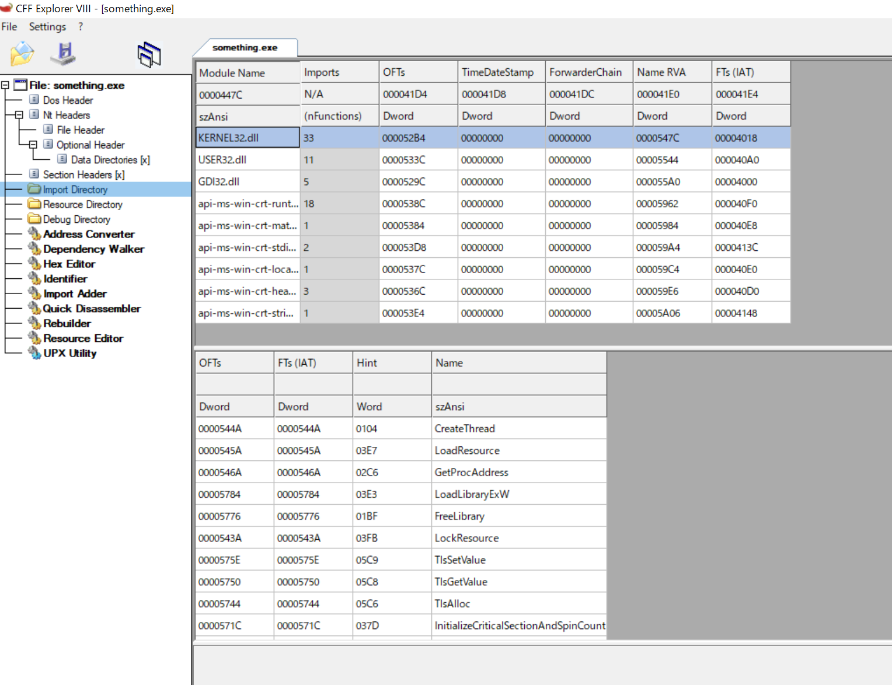

### 静的解析  

exeファイルは中身はシンプルで、メインロジックはGUIウィンドウを表示するのと、裏でスレッドを作成している関数があるくらいです。スレッドのプロシージャーの中身を見てみると、LoadResourceやLockResourceといったAPIがあるので、リソースに何かデータがあることがわかります。  
そのあとすぐ下のほうのコードでは`` (0x5A,0x4D) ``や`` (0x45,0x50) ``, `` mov eax, [ebx+0x3C] ``といったおなじみのPEのパース処理があり、この時点でリソースにPEを持っており、それをロードしようとしていると推測ができると思います。

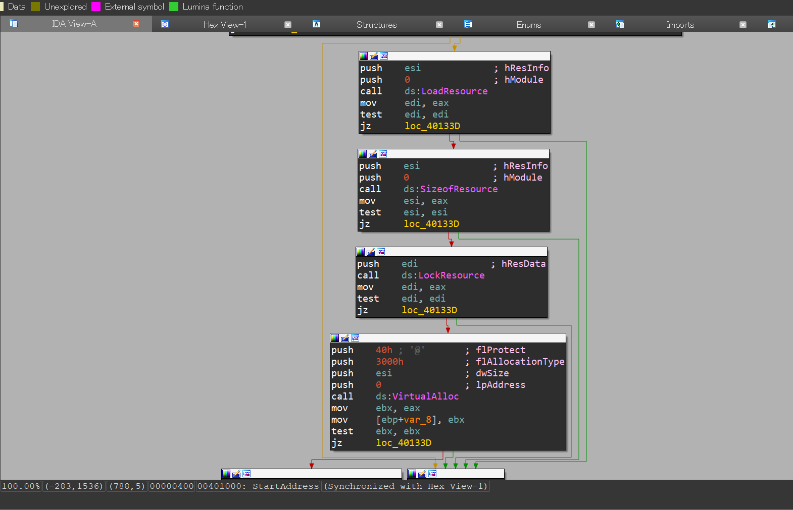  

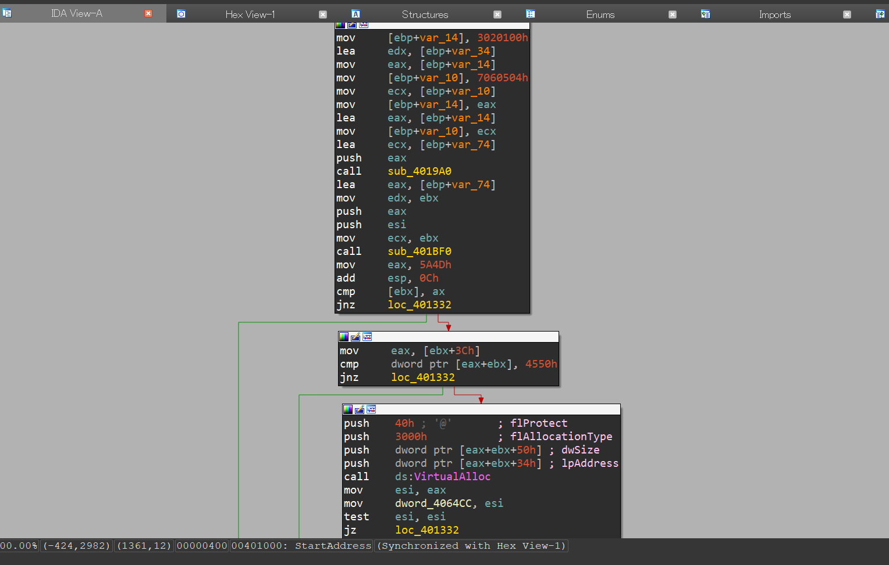  

Resource Hackerなどのツールでリソースの中身を見てみると、暗号化されていそうなPEが確認できます。 
ここまでくれば、あとはデバッガで復号後/デコード後のPEを抽出するだけです。  

復号の処理はPEのパースの前にあるはずなので、直前のコードを見ていくと、sub_4019A0やsub_401BF0で復号処理をしていそうです。なお、生成AIにコードを投げると、Salsa20などのストリーム暗号と返してくれます。
  
デバッグ実行で抽出したPEはDLLファイルであり、importを見ると通信処理を行うモジュールが見えるので、このDLLが本丸になりそうです。  

 

## Phase 2 - packet解析  

さっそくDLLを解析してもよいのですが、コード量がそこそこに多くて大変なので、問題のpcapファイルを除いてどのようなデータのやり取りがあるのかをヒントに進めていきます。  
(問題文にもpcapを見ろとあるので)  

pcapでは、主に192.168.11.132のIPとの通信がメインで行われていることがわかります。
序盤ではHTTPで通信を行っており、/configというリソースパスから何やら暗号化されたデータを受信しています。それ以降、当該IPアドレスとはTCPで通信が行われているようです。  

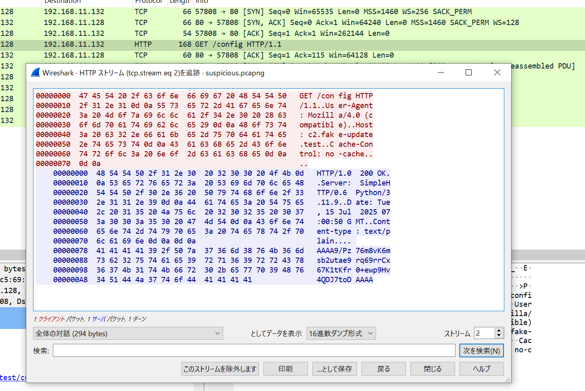

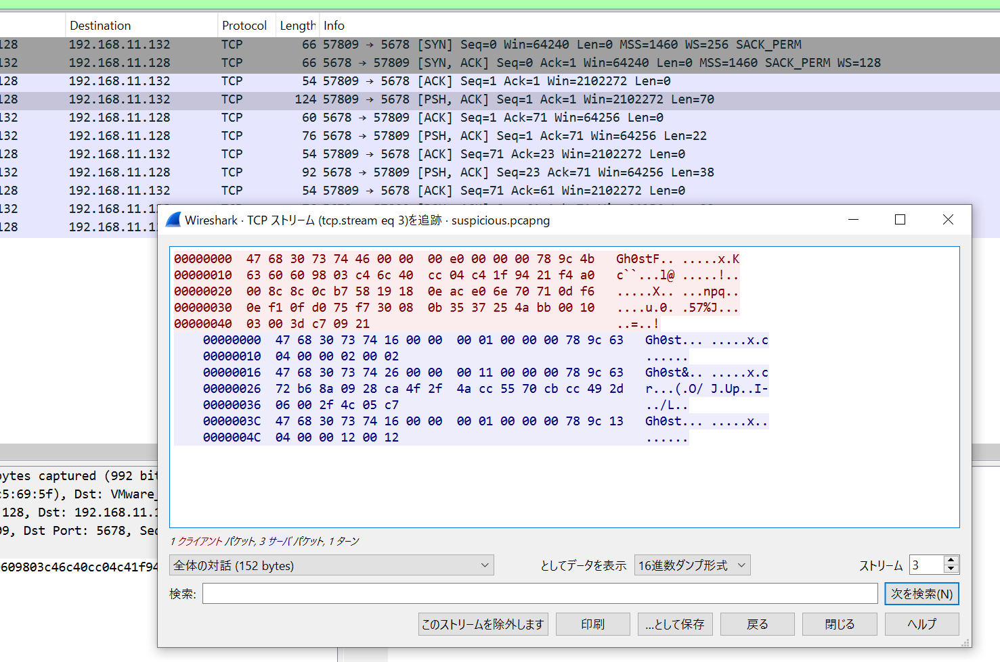


TCPのpacketを見てみると、なにやら決まったフォーマットでデータをやり取りしているように見えます。  
packetの先頭には、必ず`` Gh0st ``の文字列がつくようです。 これについて、インターネットで検索してみると、Gh0st RATやGh0stTimesといったマルウェアのレポートがいくつかヒットします。  

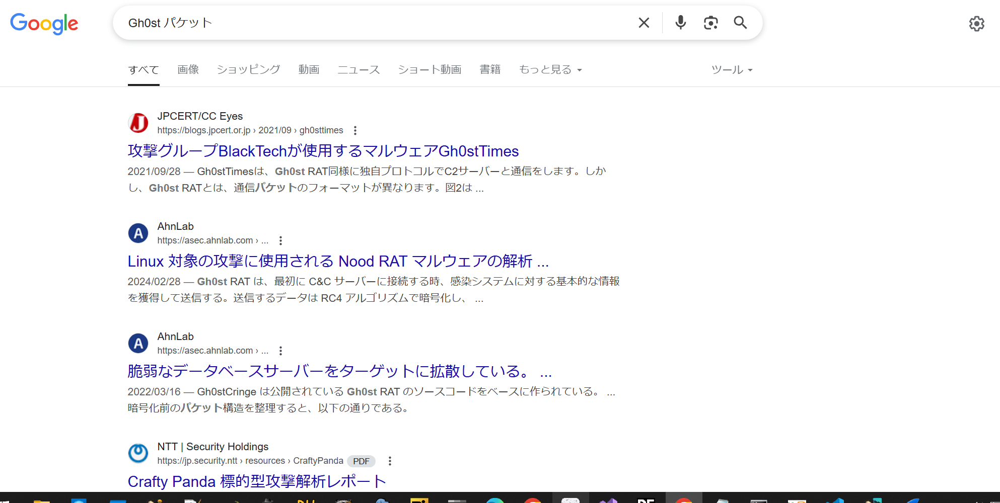

JPCERT/CCのレポートを見てみると、どうやらGh0st RATやGh0stTimesは、通信を行うのに独自のプロトコルを使用するとのことです。 
また、asecのレポートによれば、
>オリジナルの Gh0st RAT はその名の通り C&C サーバーとの通信に「Gh0st」というシグネチャ文字列を使用する。  

とのことです。
また、ペイロードが圧縮されてシグネチャの後ろに格納されているという、情報も見つかるかと思います。ここまでの情報と問題文から、pcapファイル内で記録されているデータを復号することが今回のゴールになるだろうと察しが付くかなと思います。  

- https://blogs.jpcert.or.jp/ja/2021/09/gh0sttimes.html
- https://asec.ahnlab.com/jp/32562/


## Phase 3 - DLL解析  

ここから、本体の解析に入っていきます。  
（表層情報からある程度解析のスコープを絞れるようにしているというのが、実情ではあります）  

### 表層解析  

まずは定石に従って、抽出したDLLの表層情報を見てみます。  
PPEEでDLLを開くと、エクスポートの欄からこのDLLの名称や、エクスポート関数の一覧が確認でき、**hidden**や**ResetSSDT**という名称の関数をエクスポートしているようです。ここで今回のタイトル回収ということで、  
hidden関数を中心に解析を進めていけばよさそうです。  

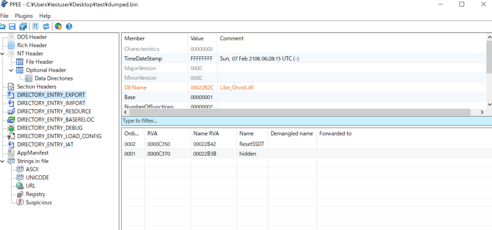

次に、stringを見てみます。  
stringでは、`` %s:flag ``や`` %s\secret.txt ``といった、フラグ取得に直接かかわってきそうな文字列も見つかるため、このアドレス周辺のコードを解析していけば、フラグまでの条件などが判明しそうな気がします。  

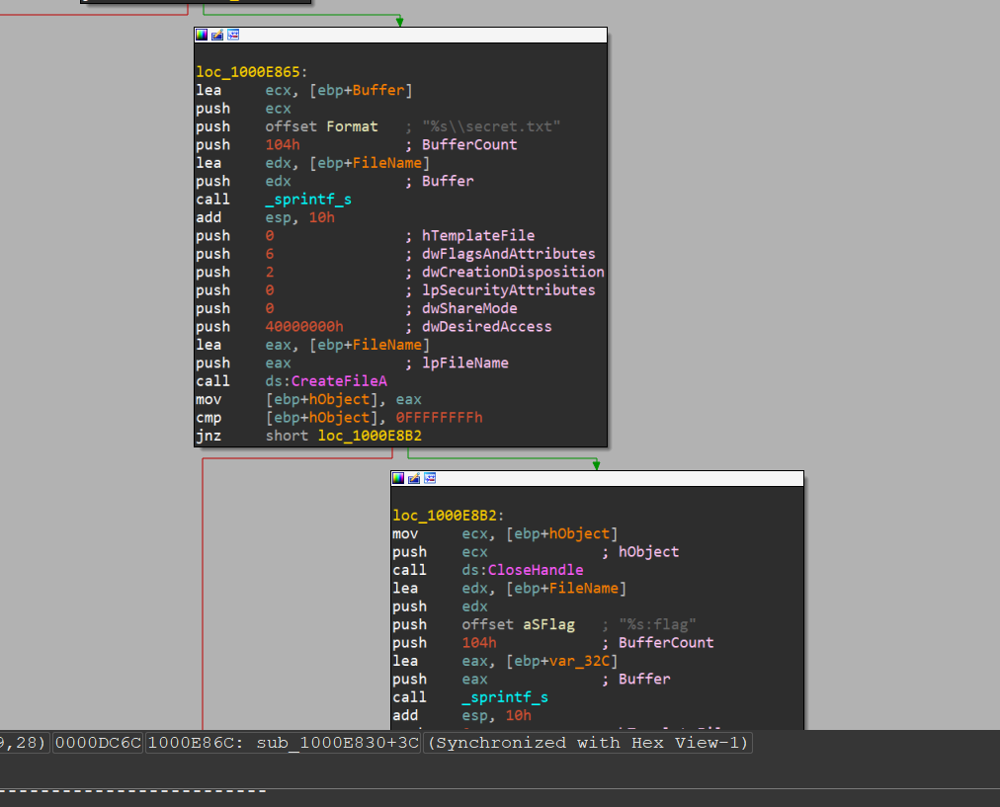

### 静的解析  

#### データ受信から解凍、コマンド分岐まで

上記の文字列が見えるサブルーチンから、１つ階層をさかのぼってみると、コードのフローがよくあるRATマルウェアのようになっていることがわかるので、ここが擬似的なC2からのコマンドを処理するメインのサブルーチンだろうと推測することができます。

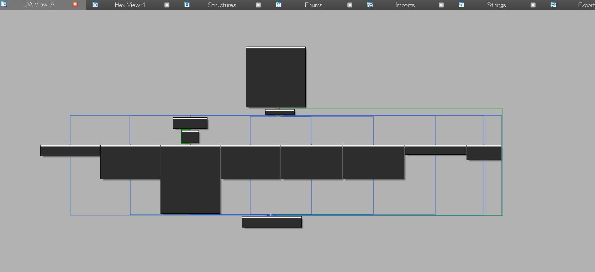  

ここまでわかったら、もう一度インターネットで収集した情報を確認します。JPCERT/CCの公開情報を見ると、Gh0st Timesの場合、独自プロトコルによる通信においてはC2から送られてくるコマンドは、zlibとRC4で圧縮/暗号化されているそうです。  
今回の検体が上記に関連したものであるとすれば、上記はかなり解析の助けになりそうですね。  
ひとまず、ジャンプテーブルでジャンプする前に何か復号に関するコードがないか、一つ上のサブルーチンにさかのぼって解析してみます。  

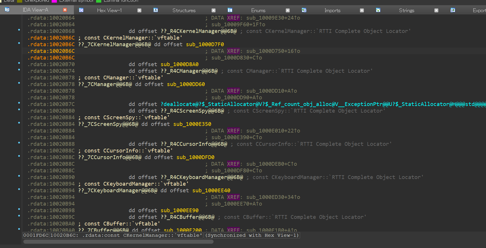  

上記のコマンドを処理するサブルーチンの１つ上の階層にクロスリファレンスで飛ぶと、厄介なことに、コマンド処理を実行するサブルーチンはクラスの仮想関数テーブルに定義されるものでした。  
こうなると静的にコードの流れを追跡していくのがきつくなってきます。

しかしながら、pcapファイルで怪しい通信はtcpで行われることがすでに分かっていて、コマンドの処理をディスパッチするサブルーチンも見つけました。  
現状は擬似的なC2からデータを受信したあとの処理を解析していきたい、というのが目標になってくるので、通信処理を行うモジュールやAPIから検索をかけて、データ受信の直接的な処理を見つけに行こうと思います。  

この検体がインポートする通信処理を担う関数にws2_32.dllがあるので、recv関数などをIDAで逆引きして該当のコードにジャンプします。 

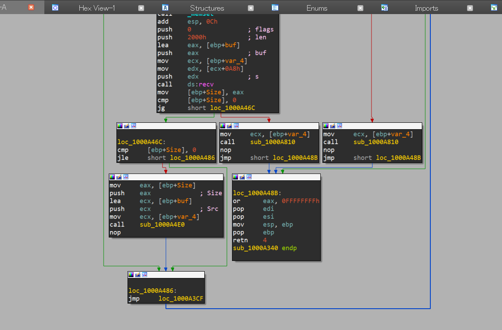

ここまでわかれば、あとは受信したデータを格納するための変数に着目して解析を進めていきます。以下はダイジェストです。  


受信したデータはパースされて、先頭に"Gh0st"の文字列があるかどうかチェックされます。 

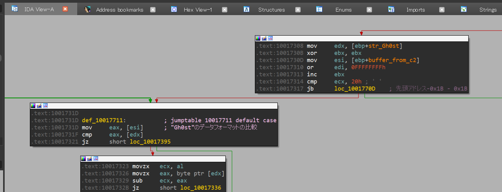

その後は、compressという文字列が見えるので、スクリプトのfindcryptなどをかけるとzlibが使用されていると推測できます。これはインターネットで調べられるGh0st RATの公開情報と一致しています。

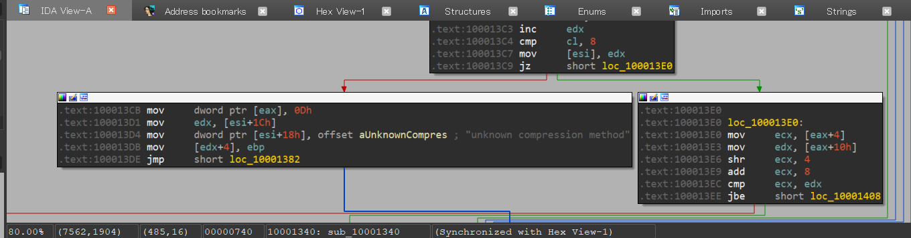

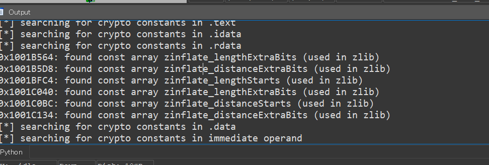


zlibによって解凍されたデータの行方を追っていくと、コード全体の序盤で初期化されたクラスのオブジェクトの属性に格納されていることが確認できます。

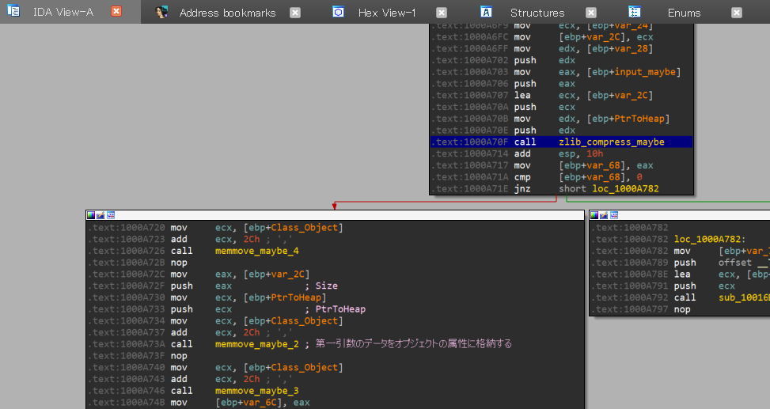

該当の変数がクラスのオブジェクトを指すことは、サブルーチンの呼び出し元まで遡っていくことで判明します。(トップダウンアプローチであれば早い段階で判明していると思います。)  

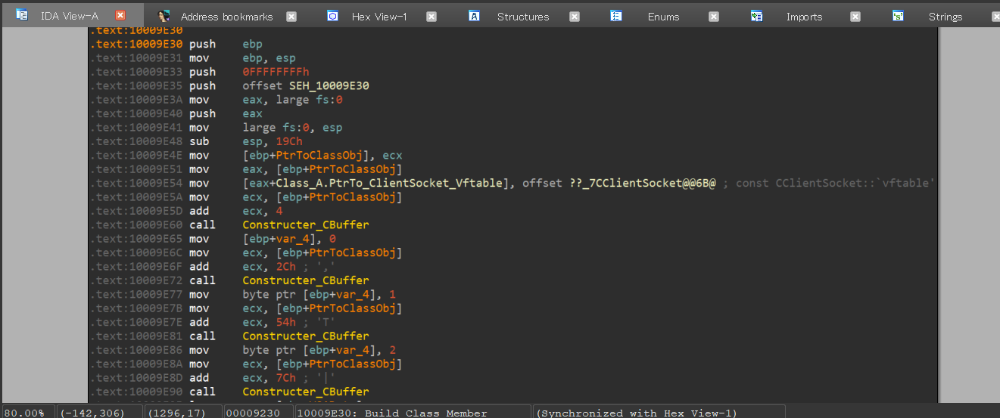　　

最終的に、解凍されたデータは`` call eax ``による関数ポインタのコールによって実行される関数の第一引数として渡されます。
ここでコールされる関数は、CKernelManagerクラスによってオーバーライドされた仮想関数であり、すでに見つけていた**擬似的なC2からのコマンドを処理するメインのサブルーチン**そのものです。  

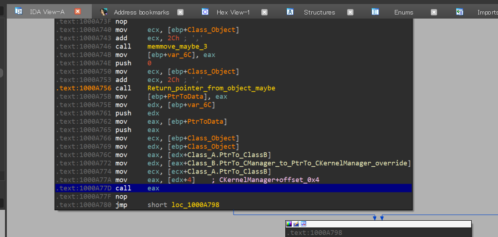  

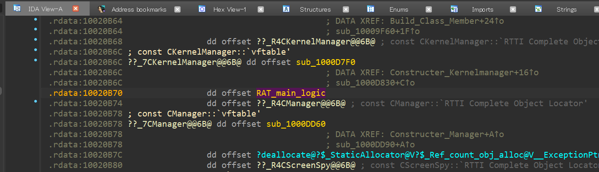  


#### 復号  

残りはコマンド分岐処理の解析とデータの復号です。
コマンド分岐の１つにsecret.txtといった文字列が使われます。それはcase16の時であり、ジャンプテーブルの上から3番目(offset0x8)のときです。また、ジャンプテーブルすぐ上の命令には配列のようなものがありますが、ジャンプテーブルでoffset:0x8の場所に飛ぶには、indexのecxは2である必要がありそうです。

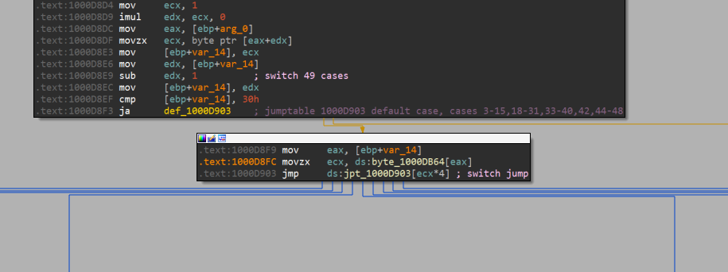  

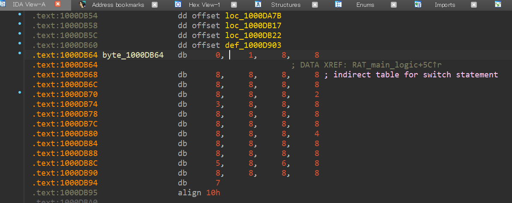

2を返すのは、配列の中のindexであるeaxが15(0xF)の時であり、
その値は直前の命令で1だけ引かれたものなので、当該サブルーチンの第一引数、すなわち解凍したデータの先頭1byteが16(==15+1)のときにsecret.txtを作成するということがわかります。  

このことから、pcapファイルにおいてC2からクライアントに向けたデータを解凍し(いくつかあるので全部試します)、その先頭が0x10(16)であるものがフラグにかかわるパケットになりそうです。  

Ghidraなどデコンパイルで見るとこの辺りのswtich caseはわかりやすく表示してくれます。  

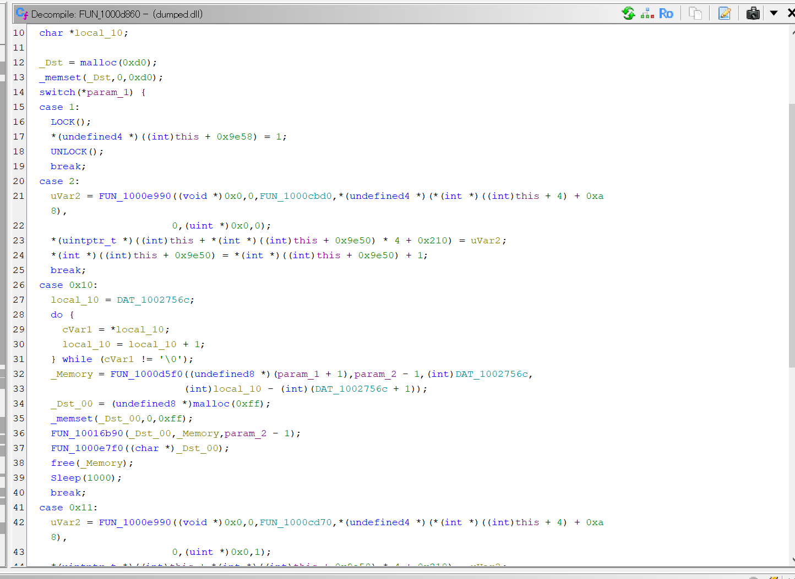


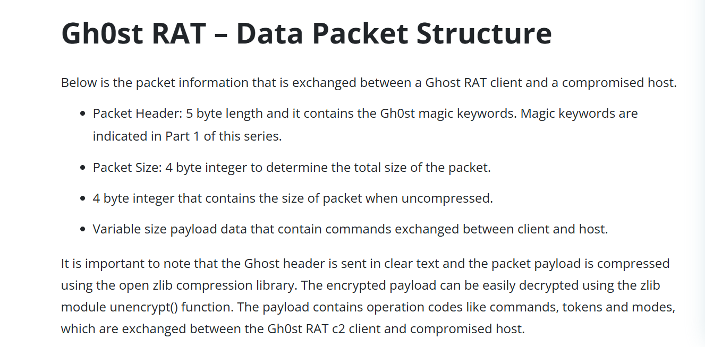
- https://www.infosecinstitute.com/resources/malware-analysis/gh0st-rat-part-2-packet-structure-defense-measures/

パケットをzlibで解凍する際は、公開情報や静的解析から、その先頭の文字列("Gh0st")とそのあとに続く8bytes(総データサイズ、ペイロードサイズ)は対象外であることがわかります。この部分を除いて解凍すると次のようになります。

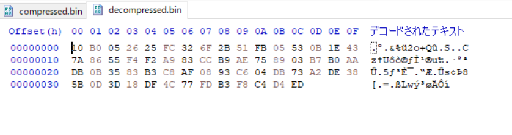  


先頭が0x10(16)のものが見つかりますが、flagらしき文字列はまだ見つけることができません。  
ディスアセンブルに戻り、case16の処理を眺めてみます。  
解凍したデータはsecret.txtの作成サブルーチンに渡されるまえに、暗号アルゴリズムらしきサブルーチンの引数として渡されています。

生成AIにコードを投げてみると、RC4と回答してくれます。  
実際、ディスアセンブルを見るとRC4の特徴(256という数値やスワップ処理など)がいくつか見つかるので、いったんRC4として解析を続けます。  

RC4であるならば、鍵がどこかで使用されているはずなので、それらしきものを探してみると、グローバル変数が鍵として使われていそうです。  

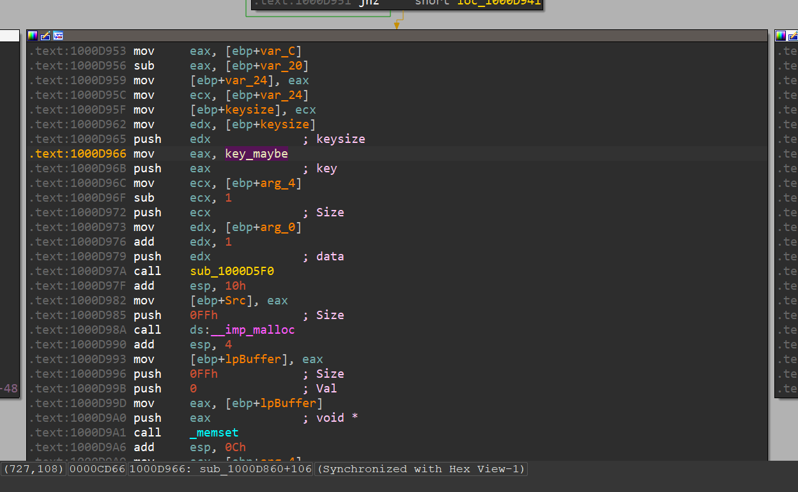  

グローバル変数に対して書き込みを行っている場所をクロスリファレンスで探してみると、InternetOpenUrlAで送ったリクエストに対するレスポンスに対して、何らかの処理を行ったものをグローバル変数に格納していそうです。  

さらにさかのぼり、urlなどを解析してみると、/configというリソースパスを使っている点や、レスポンスボディに対して"AAAA"という文字列があるかどうかを確認していることがわかるので、pcapファイルの冒頭部分の以下のデータに鍵がありそうです。

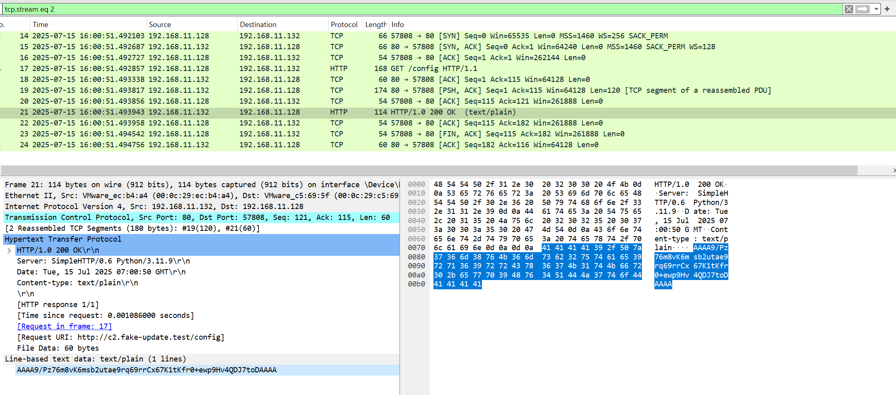

さらに、base64らしき復号処理や、固定値でのsub, xor命令を行っているので、この結果をもとにデコーダーのスクリプトを作成し、レスポンスボディの"AAAA"で囲まれた部分のデータをデコードしてみます。

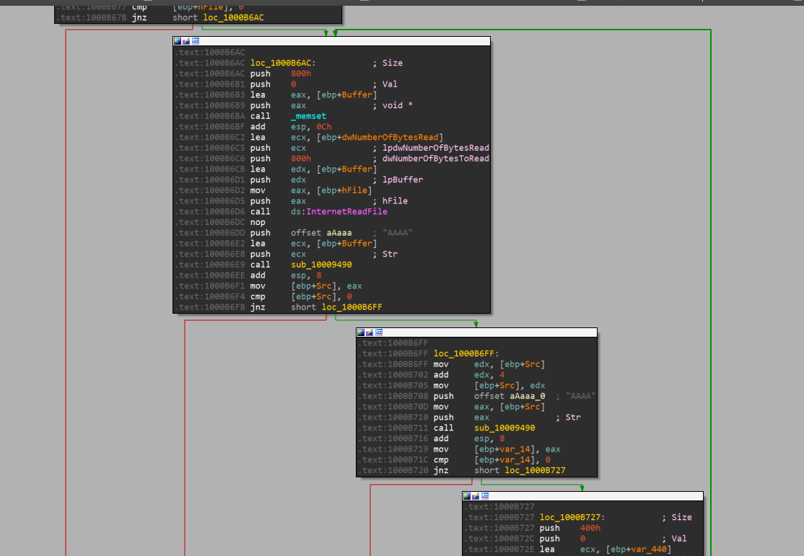

```python
import base64

def my_decode(encoded: str) -> str:
    data = bytearray(base64.b64decode(encoded))
    for i in range(len(data)):
        data[i] = (data[i] - 0x86) & 0xFF  # 元の加算を逆に
        data[i] ^= 0x19                    # XOR で戻す
    return data.decode()

data = "9/Pz76m8vK6msb2utae9rq69rrCx67K1tKfr0+ewp9Hv4QDJ7toD"

print(my_decode(data))

```

デコードの結果、以下のようなコンフィグらしきものが取得できます。  
この結果を"|"で区切ってバッファに格納し、最終的に"Tx38RpBcZqMd"という文字列を当該グローバル変数に格納していることから、これがRC4の鍵と推測します。

```
http://192.168.11.132|5678|Tx38RpBcZqMd 
```

最後に、zlibで解凍したデータから、コマンドIDである先頭1バイトを除いた内容をRC4で復号するとフラグを取得することができます。

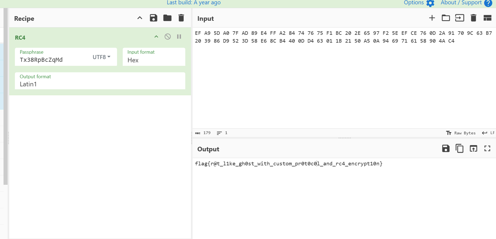
