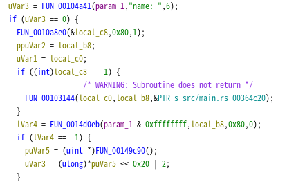
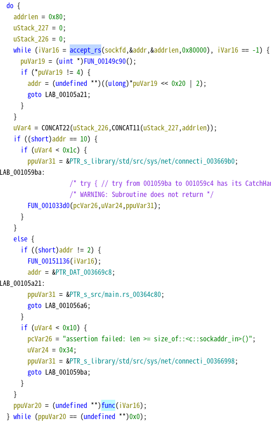
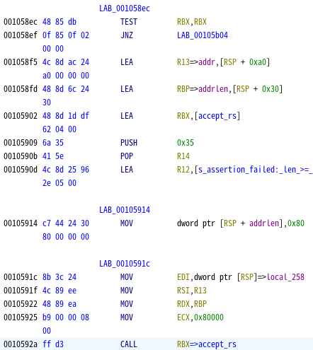

# all rust and no safe

Rust は小さいソースコードでも大きなバイナリを生成します。
ゆえに、静的解析が C と比較して非常に困難です。
加えて musl をスタティックリンクしているため、プログラムが更に肥大化しています。
その状況でどうエクスプロイトするか考える問題です。
動的解析とエクスプロイトデバッグ (と少しの静的解析) 能力が問われます。

arns は 8109 ポートをバインドして通信するサーバープログラムです。
名前通り見掛け倒しなため、動的解析すればすぐに脆弱性が見つかります。

- name で短いバイト列を入力すればリーク
- name で長いバイト列を入力すればクラッシュ

## リークの調査

とりあえず、name でリークする謎のバイト列の調査およびクラッシュ原因を突き止めます。

入力箇所を探す方法ですが、前述の通り静的解析でオーバーフローを起こす箇所を探すのは困難なため、動的解析で探します。
ただ、動的解析するにしてもあたりをつける必要があります。

リークする値を調べるには、何が send されているか調べる必要がありますが、スタティックリンクかつ strip されているため、send 関数を特定するのは困難です。

ところで、gdb には `catch` コマンドという、特定のイベントにキャッチポイントを設置し、そのイベントが呼ばれた時にブレークできるコマンドがあります。
これを使用すれば特定のシステムコールの呼び出し直後でブレークできます。
ソケット通信を行っていることから、どこかで `sendto` 等のソケット通信用のシステムコールを呼び出していることが推測できます。

name の入力後に、謎の値がぞろぞろ出ることから、送信でブレークして name で送信されている謎の値をデバッグすることにします。
送信するためのシステムコールは `sendto` や `sendmsg` です。これらにキャッチポイントを貼りましょう。なお今回は `sendto` が正解です。
`catch syscall sendto` でキャッチポイントを貼ります。
なお、キャッチポイントでなくても、`name: ` が送られてきた後 ctrl-c でブレークすると、sendto の最中にブレークできます。

`Hello <名前>!` の `sendto` でブレークしたら、第二引数 `rsi` と 第三引数 `rdx` を確認し、何がリークするか確認します。
`Hello ` の 6 バイト分ずれることを考慮し、リーク範囲を確認します。
すると、リーク範囲はスタック領域であり、スタックアドレスおよび arns のアドレスがリークすることがわかります。

## クラッシュの調査

次に、name のクラッシュを調査します。
とりあえず name に長いバイト列を入力してクラッシュさせると、リターンアドレスが書き変わって不正なアドレスを指し、クラッシュすることがわかります。
Rust はコンパイル時にメモリ安全性を確保しているため、デフォルトでは stack canary がつきません。
そのため、Rust でプログラムした箇所でスタックを破壊できる場合、canary に邪魔されずリターンアドレスを書き換えられます。

リターンアドレスから前のスタック領域を確認すれば、name が格納されている領域の先頭アドレスを特定できます。
調べると、`name + 0x60` がリターンアドレスの領域であり、`name + 0x80` まで書き込めることがわかります。

上記から、以下の 4 点がわかりました。

- スタックのアドレスリーク
- arns のアドレスリーク
- リターンアドレスの書き換え
- name はスタックに入る

## エクスプロイト

今回のプログラムはサーバープログラムです。
接続のたびにプログラムが起動する形式ではないため、プログラムを再起動しない限りアドレスは変化しません。
よって、1 回目の接続でリークしたアドレスは、2 回目以降の接続でも利用できます。

リークしたら、次はリターンアドレスを書き換えて ROP し、リバースシェルを張ります。
Rust かつスタティックリンクなため、バイナリは大きいです。便利な ROP ガジェットを見つけるのは苦労しないでしょう。
しかし、スタックが窮屈です。ROP チェーンを書き込める領域が 0x20 バイトしかありません。
したがって、stack pivot で対処します。

`pop rsp; ret` があるため、これを使用して任意のアドレスにスタックポインタを移動できます。
攻撃者が簡単に書き込めて、アドレスが既知の場所はスタックにある name しかないため、name の先頭にジャンプして ROP することとします。
とはいえ、name の先頭にジャンプしても高々 0x60 バイトしかありません。
これではせいぜい 1, 2 関数実行できる程度であり、長い文字列などの引数をスタックに入れて呼び出すのも困難です。
リバースシェルを張るにはシェルコードを実行したり、execve で bash のコマンドを実行するなどがありますが、ペイロードが長すぎて置けません。
また、こういう時は ROP 後に再び脆弱な箇所にジャンプしてデータを再度読み取らせる手法もありますが、return する前にソケットが閉じられるため、再度 recv させても追加でデータを受信できません。

ただし、今回は何度も接続できます。
1-connection 1-ROP を何度もやれれば、うまくいきそうです。

今回のプログラムはシングルスレッドであるため、ROP 後に原状復帰し、再び接続待機させ、もう一度脆弱な箇所を実行する必要があります。

Ghidra で ROP を起こせる関数を調べてみると、`name: ` のような記述があることから、これが今回の脆弱な関数 (以下、func と命名) であることが推測できます。

func の呼び出し元関数を調べると、func が do-while ループで囲まれていることがわかります。
プログラムが何度も接続を受け付けていることから、このループで接続を `accept` で待機し、接続が来たら `func` を呼び出す、よくあるエコーサーバーの実装になっていそうだと推測できます。

その仮定の下、do-while の中にある関数を調べると、`FUN_0014bbe8` (以下、`accept_rs` と命名) で 0x2b (accept) や 0x120 (accept4) のシステムコールを呼び出す箇所が見つかり、仮定が正しいことを確認できます。
そのシステムコールの引数から、関数のプロトタイプ宣言は `bool accept_rs(int sockfd, void* addr, uint addrlen, uint unknown)` とわかります。
したがって、func の実行後はこの関数を呼び出すようにジャンプすればもう一度接続できそうです。

`accept_rs` の呼び出し箇所に戻ります。
func 関数から戻ってこの関数を実行させたいわけですから、考えるとすれば、ループの先頭である `00105914` にジャンプするのが一番自然です。
ところで、`accept_rs` は `0010592a` の `call rbx` で呼び出されます。
これは ret 時に `pop rbx` で書き変わってしまいます。
ベースアドレスはリークできているため、`pop rbx` で変わらないように同じ値を入れれば回避できますが、貴重な ROP チェーン置き場が消えてしまいます。
また、rbx の他に `accept_rs` の引数も整合させなければ、失敗してしまいます。

ROP で各レジスタを整合させて、`accept_rs` にジャンプできれば簡単ですが、残念ながら 0x60 バイトの ROP では、例えそれで原状復帰できても、他のことをする余裕がありません。
そのため、なるべく ROP せずに、`accept_rs` を適切な変数で呼び出す必要があります。

`accept_rs` より上にある命令を調べると、以下のことがわかります。

- rbx は `00105902` で代入されている
- 第一引数 (sockfd) は `0010591c` で `[rsp]` から 4 バイト取り出される
- 第二引数 (addr) は `001058f5` で `[rsp+0xa0]` から取り出される
- 第三引数 (addrlen) は `001058fd` で `[rsp+0x30]` から取り出される
- 第四引数 (unknown) は `00105925` で固定値 `0x80000` が代入される (unknown の正体は flags ですが、固定値が入るだけであるため、気にする必要はありません。)

以上から、`001058f5` にジャンプすれば、必要な値を全部入れられそうなことがわかります。
rsp 絡みの変数は気に掛かりますが、ひとまずこれを使えば、ROP せずともジャンプしただけで値は設定できそうです。

次に、ROP の戦略を考えます。
スタックにリバースシェルを張るシェルコードを置けるだけの領域が無いため、何度も ROP してリバースシェルを張ります。

スタティックリンクであるため、syscall を直接実行できる ROP ガジェットはたくさんあります。
それを利用して、今回は socket, connect, dup2, execve を順次実行してリバースシェルを張ります。

1. 1 回目の接続でスタックアドレスおよび arns のベースアドレスをリーク
2. 2 回目の接続で `socket(AF_INET, SOCK_STREAM, 0)`
3. 3 回目の接続で `connect(sock, &sa, sizeof(struct sockaddr_in))`
4. 4 回目の接続で `dup2(sock, STDIN_FILENO)`
5. 5 回目の接続で `dup2(sock, STDOUT_FILENO)`
6. 6 回目の接続で `dup2(sock, STDERR_FILENO)`
7. 7 回目の接続で `execve("/bin/sh", NULL, NULL)`

connect や dup2 で socket の返り値を使用しますが、返り値のディスクリプタは連番であるため、容易に推測できます。
4 にしておくと良いでしょう。

socket や connect の引数は 3 つあります。
pop rdi, pop rsi, pop rdx, pop rax (syscall 番号を指定するため), syscall ガジェット、そして accept ループに戻るためのアドレスを踏まえると、最低 0x50 必要です。
また、accept ループに戻った後、sockfd が `[rsp]` から取られることを考えると、accept ループのアドレスの下に 4 バイト、sockfd を書く必要があります。
よって、0x54 バイト必要です。ROP 領域は 0x60 ですから、なんとか足りそうです。

次は connect に渡す `sockaddr_in` です。これは 0x10 バイトであるため、スタックに入れるには大きすぎます。
ROP チェーンをどうにか工夫して短縮するのも考えられますが、`sockaddr_in` の後ろ 8 バイトは予約の `sin_zero` であり、特に使われないため前半 8 バイトだけで足ります。
もし `sin_zero` 含め入れたい場合は、stack pivot 前の 0x20 バイトのスタック領域に格納しても問題ありません。
pop rsp ガジェットを使用すれば 0x10 バイトで stack pivot できるため、残りの 0x10 バイトを使用して格納しましょう。

最後の execve でも `/bin/sh\x00` を入れる必要がありますが、execve の実行時点でリバースシェルが完成するため、accept loop へ戻るコードは不要です。そのぶん空いた領域に適当に入れましょう。

以上を踏まえて、エクスプロイトを実装します。
その他、こまごまとした問題はデバッグしながら解決していきます。

1. func から stack pivot した上に無理矢理 accept ループに戻るため、接続のたびに name のアドレスが 0x18 ずつずれていくことに注意しましょう。
2. 上記を普通に実装すると、dup2 の後に `accept_rs` の第二引数、第三引数が壊れます。これはスタックのずれによるものであるため、connect と同様の回数 pop するダミーを入れるなどして回避します。

なお、これ以外にも、ROP でペイロードを少しずつ書き込み + accept(3, 0, 0) 呼び出しをする方法もあります。
